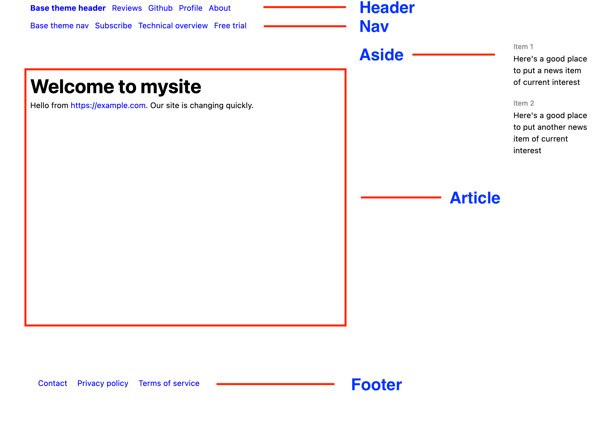
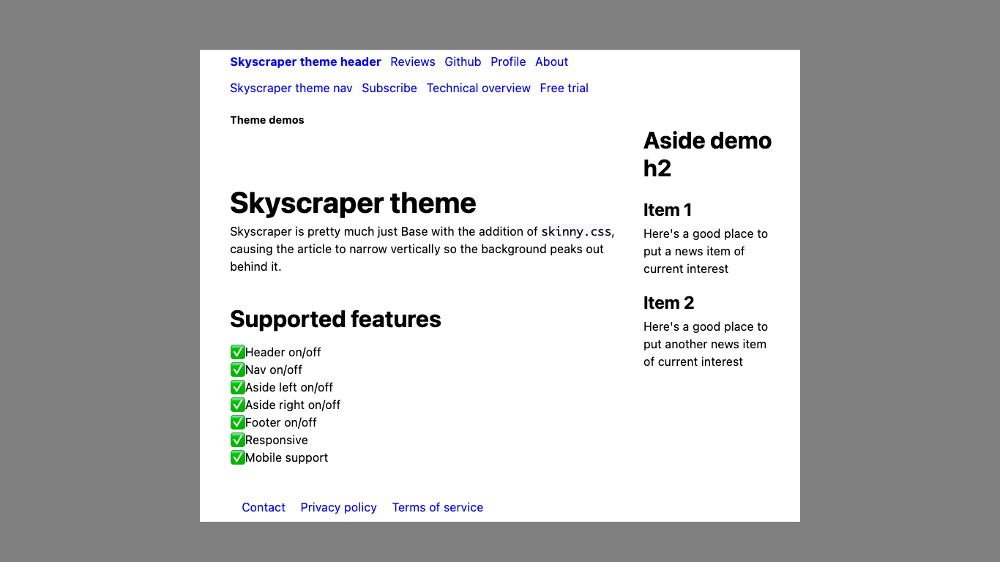
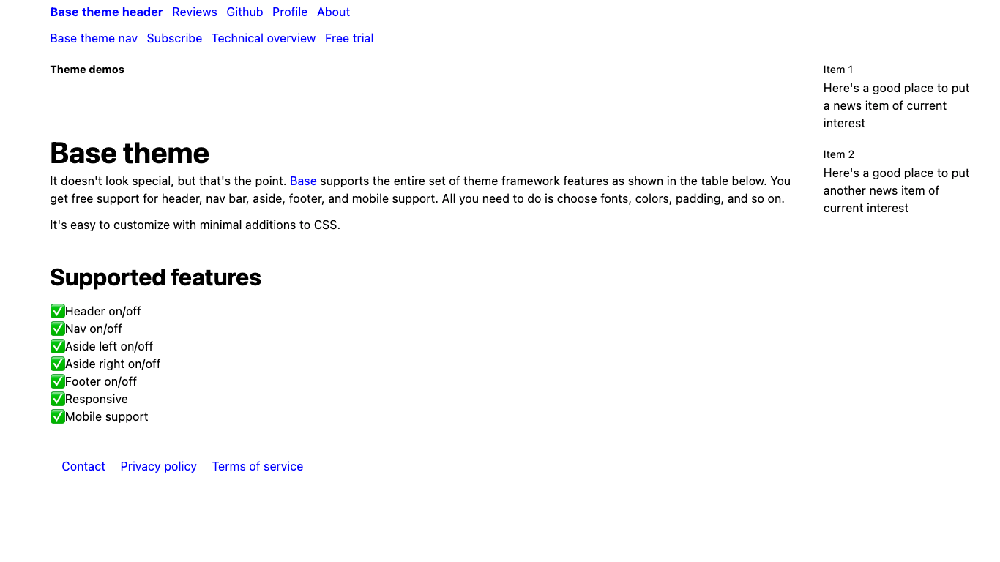

# Glossary


## article

The *article* is the main body text of a web page. In the
example below, the article consists of the worlds `hello, world.`:

```
---
theme: "informer"
---
hello, world.
```

When rendered as an HTML page using the PocoDocs theme, you'll also
see a header, nav, aside, and footer. Those are *not* part of
the article. They're known as page [layout elements](#layout-element).

## anchor text

In HTML, a link to a site has at a minimum these essential elements:

```
<a href="https://example.com">Examplicious!</a>
```

As you can probably guess, the destination URL for this link is
the legendary site `https://example.com`. The part that humans
read on a web page can be anything, and the term for it is
*anchor text*. 

In Markdown you'll see links formatted this way:

```
[Examplicious!](https://example.com)
```

Such a link gets converted to the precise form shown above it.
Anchor text is a little more important that you think, because
it's considered in [SEO](#seo) and accessibility factors. 
If you have a site about nutrition and you're writing about 
riboflavin, this link:


##### Uh-uh

```
Read [here](https://example.com/riboflavin)
```

Is much less helpful than this one:

##### That's what I'm talking about

```
Learn more about [riboflavin's role in metabolism](https://example.com/riboflavin)
```

## burger menu

The navigation menu that appears only on small format screens, such
as phones. It is a simple list of links that replaces 
the [header](#header), which often has too
many links or bulky brand identification to fit comfortably 
on the small screen.

## code block

Synonomous with [code fence](#code-fence)

## code fence

A [code fence](highlighting.html) surrounds arbitrary text with lines
consisting of 3 tickmarks: \`\`\` so that the text displays
in a monospace font. It's good for distinguishing blocks
of code in an article. Here's an example.

```
// Return the current time as a string
func theTime() string {
  t := time.Now()
  s := fmt.Sprintf("%s", t.Format("02 Jan 2006 15:04:05"))
  return s
}
```

## CommmonMark

The term *CommonMark* is the name of a community standard for
for the [Markdown](#markdown) text formatting
conventions used to generate your web pages. 
In these help pages it is synonomous with 
Markdown and markup.
<a name="front-matter"></a>

## front matter

Front matter is everything in between the line starting
with `---` to its matching `---`  line at the end. All front
matter entries consist of a single key followed by a `:`
colon character, a space, and a value consisting
of one or more items. PocoCMS uses the key to look up 
the value.

In the example
below, there are two entries in the front matter: `Title`
with the value `Introducing PocoCMS`, and 
has a key nameed `Stylesheets`, with the value consisting
of multiple stylesheet names that will  be added as
separate `<style>` tags in the finished HTML document. 

    ---
    title: "Introducing PocoCMS"
    theme: "base"
    stylesheets: 
    - ../../css/skinny.css
    ---

See [Front matter](front-matter.html) for more details.

## global theme

A global [theme](#theme) creates 
default styling for every page
in your site. 

The global theme can only be set on the [home page](#home-page).
Use [page theme](#page-theme) to add a theme to a single page.

To set the global theme, go to your home page and add this
front matter (replace "poquito" with whatever theme name you wish):

    ---
    theme: "poquito"
    ---


## h1, h2, h3, h4, h5, h6

HTML headings, corresponding directly to heading
levels in Markdown. See [heading](#heading).

## heading

The term *heading* has a specific meaning in HTML. 
Most body text is in paragraphs. Take a typical
sentence like this one:

```
PocoCMS lets you start a website in just a few seconds.
```

That body text gets translated into `<p>` or *paragraph* tags
in HTML, like this:

```
<p>PocoCMS lets you start a website in just a few seconds.</p>
```

Sometimes you need to emphasize something, so you emphasize
it this way:

```
# Getting Started

PocoCMS lets you start a website in just a few seconds.
```

The `Getting started` portion will usually be emphasized visually in some way,
typically through font height and weight. When you have a line starting
with `# ` it means use the most important weight, or a header 1.
It gets translated into HTML like this:

```
<h1>Getting Started</h1>
```

There are 6 levels of headings: `h1` through `h6`. Start
a line with a `#` for each one. This Markdown:

```
### Create a site
```

converts to the HTML:

```
<h3>Getting Started</h3>
```

While all 6 levels of indentation can provide useful visual cues to the reader,
search engines usually respect only 3 levels.


## hide

You'll often see [front matter](#front-matter) that looks like this
to [hide parts of a page](gs-parts-of-theme.html#hiding-header-nav-aside-or-footer-on-a-per-page-basis) such as the [header](#header),[nav](#nav),[aside](#aside), or [footer](#footer):

```
---
hide: aside
---
```

This makes the selected page layout elementl disappear
for that page only.

## home page

The home page is a file named either `index.md` or `README.md`
in the root directory of your project. It has some special
properties, for example, it's the only file you can use to 
`theme` to set a global theme for the site overall.

*README.md vs index.md*

If you have two home page files in the root directory, 
one named `README.md` and another named `index.md`, 
the one named `README.md` takes priority. 
It is renamed `index.html` in the [webroot](#webroot)
directory when your site is generated.

*Why index.html is important*

When someone visits your website, the web server looks specifically
for the distinguished file named `index.html` in its own webroot directory, so
`index.html` has special importance.

The reason `README.md` takes priority over `index.md` is that's how many
previous site generators roll, such as the one on GitHub.

### Defining a global theme on the home page

The home page lets you define a [global theme](#global-theme) for the entire site.
If you add `theme:` followed by the theme name to the front
matter as shown below, all pages of your site will default to
the global theme without your having to specify it on each page.
For example, this defines `wide` as the global theme:

    ---
    theme: pocodocs
    ---


If you use a global theme you always have the option to
override it on a per-page basis using `pagetheme`:

    ---
    pagetheme: pocodocs/home
    ---


## Layout element

A finished PocoCMS web page includes the following
layout elements: [header](#header), [nav](#nav),
[article](#article), [aside](#aside), and [footer](#footer). 
Each layout element directly corresponds
to an HTML tag. Most of them can be disabled on a per-page
basis, overriding the theme definition.

#### Layout elements illustrated



### header

The `<header>` element, normally referred to simply as the *header*,
appears at the top of the page. It is likely to look similar on
most pages of your site. It usually makes your site easily
identifiable, normally has a clickable logo that brings
users back to the home page, and may have some common navigation
elements.

### nav

The `<nav>` element, normally called the *nav* or *navbar*, 
is sandwiched between the header and the article. It should
look similar on most pages of your site. It usually has
some common navigation elements.

### article

The `<article>` element contains the text of your 
Markdown page after conversion to HTML. It appears under the navbar. It is normally unique on each page of your site. Search engines
don't like to see articles or [title tags](front-matter#title)
repeated.

### aside 

The `<aside>` element acts as a sidebar. It normally appears to the
left or right of the article. HTML recognizes only one aside
per page.

You can usually control which side it appears on using [sidebar](#sidebar)
in the [front matter](front-matter.html#sidebar)

### footer

* The `<footer>` appears at the bottom of the page right after
the article. It should look similar on most pages of your site.
It usually has identifying information for the company and
some common navigation elements such as links to contact,
terms and conditions, privacy policy, and sitemap.

Layout elements appear on the page only if the theme has defined
theme. They can be omitted one page at a time
by using `hide`, then their tag type in the front matter. 

For example, to prevent a sidebar from appearing on the
current page, you'd add this to the [front matter](#front-matter).

```
---
hide: aside
---
```
For more on layout elements, read about the structure of a  
[complete HTML document](https://developer.mozilla.org/en-US/docs/Learn/HTML/Introduction_to_HTML/Document_and_website_structure#HTML_layout_elements_in_more_detail) on MDN.


## Markdown

Markdown is a sensible way to represent text files so that they read easily as plain text if printed out as is, but which also carry enough semantic meaning that they can be converted into HTML. Markdown is technically known as a *markup langauge*, which means that it contains both text, e.g. hello, world, and easily distinguishable annotations about how the text is used, e.g. marking up *hello* to emphasize the word in italics--its markup. The name markdown is a play on the term markup. The name markdown is a play on the term markup. 

The closest thing to an industry standard for Markdown is CommonMark. PocoCMS converts all CommonMark text according to specification, and includes extensions for things like tables, strikethrough, and autolinks. See the source to Goldmark for more information on extensions.

Take this example of Markdown you might use in a document:

```
# Introduction

*hello*, world
```

The above would be converted in HTML that looks like this.

```
<h1>Introduction</h1>
<p<em>hello</em>, world.</p>
```

That means the `# Introduction` line actually represents the HTML heading type h1, which is the hightest level of organization. `## Introduction` would generate an h2 header, and so on.

The asterisk characters are replaced by the `<em>` tag pair, which means they have the semantic power of emphasis. This is represented by HTML as italics, although you could override it in CSS.

In these help pages Markdown is synonyomous with markup and CommonMark.


## Markup 

The term *markup* generally refers to the [Markdown](#markdown) text formatting
conventions used to generate your web pages. In these help pages it is synonomous with 
Markdown, markup, and [CommonMark](#commonmark).

Technically speaking HTML is also a [markup language](https://en.wikipedia.org/wiki/Markup_language) but in the context of static site generators
such as PocoCMS the term normally refers to Markdown.

## named anchor

A *named anchor* is a destination you can click to in an HTML document.
Here's an example of a level 2 [heading](#heading) serving
as a named anchor.

```
<h2 id="why-markdown">Why Markdown?</h2>
``` 

In the document itself it will simply appear as a clickable link
with the text `Why Markdown?` exactly as it would if the
in-document location marker `id="why-markdown"` weren't there.
But that location marker, which is required to be unique within
the document, allows you to create a link like this
taking you directly to that heading:

```
[Why Markdown?](gs-creating-and-linking-pages.html#why-markdown)

```
PocoCMS creates unique named anchors automatically for all [headings](#headings).


## page theme

A page [theme](#theme) controls the appearance of a single page. 
It overrides the [global theme](#theme), if any.

To set a theme for a single page, use `pagetheme` in the 
front matter like this, where you'd replace `pocodocs` with any
theme you have available:

```
---
pagetheme: "pocodocs"
---
```


## .poco directory

Each site you create with PocoCMS has a directory named `.poco`
in your site's [root directory](#root-directory).
It's automatically created when you use `poco -new` to create
a site. 
```
.
├── index.md
│   
├── WWW
│   └── index.html
│   
└─── .poco
```

The contents of the `.poco` directory are ilustrated in
[.poco directory structure](technical-overview.html#poco-directory-structure)

The `.poco` directory contains things like 

* All PocoCMS themes you have available
* All CSS files required by your project
* Javscript files required by your home page
* A few small assets used to demonstrate PocoCMS features

Wherever the Poco application is stored, it has a master copy
of the `.poco directory` used to generate the `.poco` directory
in each project. That means if you change the themes in that
directory, you may wish to copy those changes to the `.poco`
directories in projects you created prior to those changes.


## project

A PocoCMS *project* is a directory tree with the
source Markdown files and other assets required to 
create a website. The name of that directory 
is used as the name of your project.  It is
also called the [root directory](#root-directory).

### Parts of a project
At a minimum, a project consists of:

* its containing or [root](#root-directoroy) directory,
* a [home page](#home-page), which is a Markdown file named
either `index.md` or `README.md`, and
* a webroot subdirectory, by default named `WWW`. 

You can't do much without a [.poco directory](#poco-directory), which contains assets
such as themes and stylesheets.

Sometimes we use the words `site` when we're talking about your
project, even though technically your site is what's generated  by
PocoCMS and copied into your [webroot](#webroot)

## root directory

The root directory is the starting point of your
PocoCMS [project](#project), and because it also
holds the [.poco directory](#poco-directory) it's
important to know what root directory means. 
When you do something like

```
poco -new mysite
cd mysite
```

Then the root directory is `mysite`. If at some point you create a new directory
and change to it you are no longer in the root directory:

```
poco -new mysite
cd mysite
mkdir reference
cd reference
```

At this point you're in `mysite/reference` and you are no longer in 
the root directory. The reason to understand this distinction is that
you will sometimes need to do something like edit a theme,
and you do so via the [poco directory](#poco-directory). You'd
do that by making sure you're in the root directory, then load
  up a the file by giving an address of something like
`.poco/themes/base/README.md` for the Base theme or 
`.poco/themes/electro/README.md` for the Electro theme.

## semantic meaning

The term *semantic meaning*  
means in HTML that the structure of a document gives
different weight to the information being presented. 
For example, if you make the title of your page
distinct simply by choosing large letters in boldface,
you're missing out. If instead you enclose it 
in `<h1>` tags, search engines and screen readers
will probably assume it's something people are more
likely to scan and remember.

Conversely, if you fill your page with dozens of
`<h1>` tags they will lose their semantic power.

Your page is not just made of the [article](#article). It also
has other [layout elements](#layout-elment): the header, nav bar, aside,
and footer. These too are given semantic meaning.
By definition the aside will be considered less
important than the article. The header is probably more
important than the footer, and so on.

## SEO

SEO, or search engine optimization, is the art of structuring and
writing your site so that it's more likely to be found in web searches.
[PocoCMS SEO](seo.html)


## sidebar

The PocoCMS theme framework supports [asides](#aside), which appear
to the left or right of the article. Depending on theme support
you can control which side they appear on using the `sidebar`
rule in the [front matter](front-matter.html#sidebar), like this:

```
---
sidebar: left
---
```


## site

See [project](#project)


## skinny theme

"Skinny" theme is an informal term to describe themes where you can see the HTML
background to the theme. Take a look at the Skyscraper theme:



Now compare it to the Base theme:



You only see the HTML background in Skyscraper. Its source code  almost identical to
Base. The only differences are that `skinny.css` is added to the [theme README](https://raw.githubusercontent.com/pococms/poco/main/.poco/themes/skyscraper/README.md) for Skyscraper:

```
stylesheets:
- ../../css/root.css
- ../../css/reset.css
- ../../css/sizes.css
- ../../css/layout.css
- ../../css/type.css
# Add this or medium-skinny.css to make the theme skinny
- ../../css/skinny.css
- ../../css/mediacolors.css
- skyscraper.css
```

And a contrasting
HTML background CSS variable is supplied in the [skyscraper.css](https://github.com/pococms/poco/blob/main/.poco/themes/skyscraper/skyscraper.css) file:

```
@media (prefers-color-scheme:light) {
:root {
  --html-bg:gray
}
}

@media (prefers-color-scheme:dark) {
:root {
  --html-bg:SteelBlue;
}
}
```


## source file

A *source file* is the Markdown file used to create a matching HTML file for output.
For example, most directories have a source filenamed `index.html`, which
is the default location web servers look when users navigate to a 
website

## static site generator

A static site generator like PocoCMS takes some kind of text input,
for example, [Markdown](#markdown), applies style sheets
to it, converts that text to HTML, and generates an
ouput directory full of HTML and stylesheets. That directory,
called the [webroot](#webroot),
is ready to be published to a web server.

### Templates

To drill down a little deeper, the static site generator normally
applies a consistent visual appearance by including a set
of stylesheets, graphics, and other assets to the generated
web page before generating the HTML. 
In the case of PocoCMS, templates are made up 
of standard HTML [page layout](#page-layout) elements:
[header](#header), [nav](#nav),[aside](#aside), and [footer](#footer),

### Assets

The site may also include assets such as graphic images, video
files, and so on. Those get passed through unchanged to the


## style tag

You can override a page's stylesheet with *style tags*. These are the
enclosed in `<style>`/`</style>` tags on the page. They are loaded 
after stylesheets, so you're guaranteed that they have the final say
on that page.

See [front matter](front-matter.html#styles) for a complete example.


## theme

A PocoCMS theme is a collection of stylesheets and Markdown files 
contained in a directory (folder). 
The directory is used as the name of the theme. 
The theme can specify styles to include on every page of the site. 
The theme can also specify 
[layout elements](#layout-element): a [header](#header), [nav bar](#nav), [footer](#footer), or [aside](#aside) to include on each page.

There two kinds of themes: global, and page. A global theme causes all
pages in the site to use the same theme without having to specify it
every time in the page front matter. See [home page](#home-page) for
a usage example.

You can specify themes on a per page basis. For example, if you want
to use the theme named `electro` you would add this to your Markdown page:

```
---
theme: electro
---
```

### How to find out what themes are installed

To find out what themes are installed on your machine, just run
this at the command line:

```
poco -themes
```

### Technical overview of a theme

A theme minimally consists of:

* A directory in `.poco/themes`
* A `README.md` in that directory, called the [theme README](#theme-readme)
* A `LICENSE` file

More likely the `README.md` has a list of stylesheets and Markdown
file that define the theme's header, nav, aside, and footer.

## theme directory

The theme directory can be found in [root directory](#root-directory) 
at `.poco/themes/themename`, where you'd
replace `themename` with the name of the theme you're interested in.
So if the theme name is Base, the theme directory 
would be `.poco/themes/base`.


## theme README

A PocoCMS [theme](#theme) is a collection of stylesheets, 
Markdown files, and other assets 
listed in the file `README.md` file for that theme's directory.
Suppose you choose the Electro theme for your document:


```
---
pagetheme: electro 
---

# Electro theme test

hello, world.
```

The Electro theme's file in `.poco/themes/electro/README.md`
looks something like this:

```
---
header: header.md
nav: nav.md
aside: aside.md
footer: footer.md

importrules:
- url('https://fonts.googleapis.com/css?family=Nova+Mono&display=swap');
- url('https://fonts.googleapis.com/css?family=Roboto+Condensed:400,700&display=swap');    

stylesheets:
- ../../css/root.css
- ../../css/reset.css
- ../../css/sizes.css
- ../../css/layout.css
- ../../css/type.css
- ../../css/skinny.css
- ../../css/mediacolors.css
- electro.css
---
.. etc
```

It derives the fundamental visual appearance from the stylesheets. 
Page layout elements get their definitions from files named `header.md` and so forth.


## title

Each HTML document should have a [title](https://developer.mozilla.org/en-US/docs/Web/HTML/Element/title) tag. Often the title tag determines what
text appears to people [searching on the web](https://developers.google.com/search/docs/appearance/title-link), and it's normally
used for browser tabs as well. 

## unique identifier

Sometimes you can link not just to an HTML document, but inside it
at a particular location. That requires an `id=` attribute
in the HTML that looks something like this:

```
<h2 id="why-markdown">Why Markdown?</h2>
``` 

This is called a bookmark or [named anchor](#named-anchor).

PocoCMS inserts these automatically for all [headings](#headings).
It ensures they're unique even if the headings appear externally
to be the same. The foregoing case works for the page
at on this site at `/docs/gs-creating-and-linking-pages.html` with the following
Markdown:

```
[Why Markdown?](gs-creating-and-linking-pages.html#why-markdown)

```

Try clicking it [here](gs-creating-and-linking-pages.html#why-markdown) if you wish.

 


(Astute web developers will know that the ID isn't just there for
bookmarking purposes, but it is the context for HMTL
anchors in this documentation.)

## user application data directory

Every operating system has a preferred location for storing
data from third-party apps such as PocoCMS.

PocoCMS comes with a package of themes, stylesheets, graphic assets, and
JavaScript files, and a few other goodies.  When you create a [project](#project) 
with `poco -new`, these are all copied into the `.poco` subdirectory.
The original source of those themes is under `pococms` in
your user application data directory. Here's how to view your 
user application data directory in some of PocoCMS's supported
operating systems. Open up a terminal and type:

### Viewing your user application data directory on Windows

```
echo %AppData%
echo %AppData%\pococms
```

### Viewing your user application data directory on Mac

```
echo $HOME/Library/Caches
echo $HOME/Library/Caches/pococms
```


### Viewing your user application data directory on Linux
```
echo $XDG_CACHE_HOME
echo $XDG_CACHE_HOME/pococms
```


## web root
Synonymous with [webroot](#web-root).

## webroot

The webroot is a directory contains all files generated by Poco CMS required 
for your website. By default it's a subdirectory under the directory 
used for your project named `WWW`. You can 
designate a different directory using the `webroot`
[command line option](cli.html#webroot)

To make your website visible to the world, all you have
to do is copy those files into a publicly available directory
at a web host.

### Note

PocoCMS always deletes the webroot before building a project. You can
prevent this with the `-preserve` [command line flag](cli.html#preserve).

```
poco -preserve mysite
```

## YAML

YAML is a language used to describe data in a way that people
can figure out very easily, just the way [Markdown](#markdown)
is a way to describe how a document should be displayed.

### key/value pairs

YAML can get pretty descriptive but it's mostly used to
represent either single values, or simple lists of values.
Each of thes entities is described by a title called a
*key*, and it's assigned a *value* in the YAML.


In YAML, key/value pairs are separated by a colon, as shown next.

### Keys that hold a single value

For example, here the `header` key is assigned the
value `news-header.md`:

```
---
header: news-header.md
---
```

In this particular context the value is treated as a filename,
but that doesn't matter here. The key is `header` and its
value is `news-header.md`.

Note that the key and the value are on the same line.

### Keys that hold a list of values

A key can hold a list of values. In that case, the key
and `:` colon are on line by themselves,
and the list values are separated by new 
lines, thd `-` character followed by a space,
and then the value:


```
---
stylesheets:
- ../../css/root.css
- ../../css/reset.css
- ../../css/sizes.css
- ../../css/layout.css
- ../../css/type.css
- ../../css/colors.css
- ../../css/media.css
```
### Value lists are ordered

When style sheets are declared in a document, their order
is important. CSS works that way on purpose. You can define
rules on document A, and if document B follows it,
anything B defines that's found in A is overriden.

YAML values lists preserve their ordering, so in the
example above it is guaranteed that `../../css/root.css` 
will get loaded first, then`../../css/reset.css` and so on.
 
 


The rules used here are restrictive but YAML is much
more expressive than that. PocoCMS uses very simple
formatting to make it easier to stay consistent and
to scan lists at a glance. 
Learn more about YAML at [YAML.org](https://yaml.org/)


