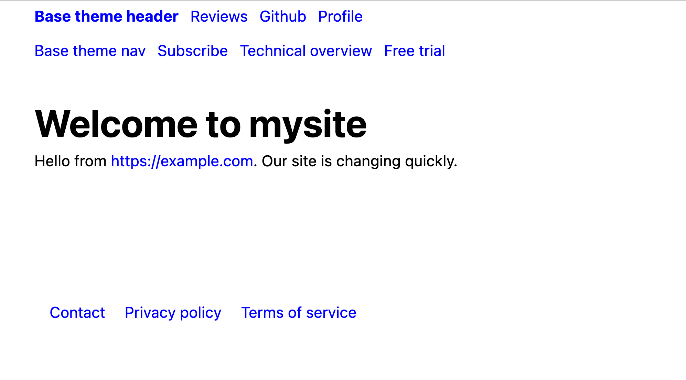
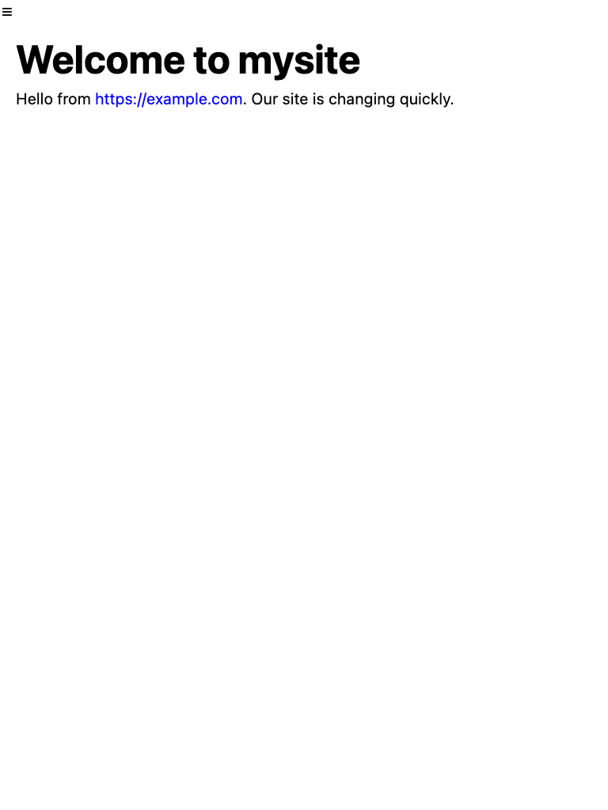
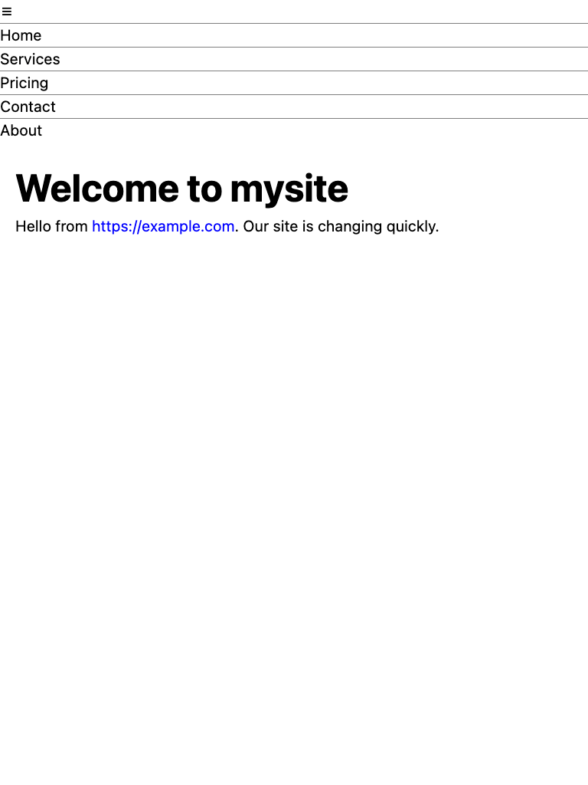

# Changing themes

Recall that we were left with this newly edited page:


We can totally remodel this tiny site with one change.

* Add `pagetheme: informer` between the lines at the top of the `index.md` page:

```
---
title: "Powered with &hearts; by PocoCMS"
pagetheme: informer
---
# Welcome to mysite

Hello from https://example.com. Our site is changing quickly.
```

* Save the file and run poco again. 

Things are looking up!


If you're in dark mode, you will see that the theme automatically takes advantage of it:


That's because it was made with the [PocoCMS theme framework](theme-framework.html),
which has a ton of other advantages, such as automatic mobile support responsive mode,
and other traits to be discussed later.

## Front matter

By the way, you'll note that you can change how the blog looks
by changing things you see in between lines of 3 dashes (`---`)
as shown here:
```
---
title: "Powered with &hearts; by PocoCMS"
pagetheme: informer
---
```

You will have noticed that it doesn't affect the text of the article.
That's because it's technically a separate document called the
[front matter](glossary.html#front-matter). You don't need
front matter in a PocoCMS file, but you'll find it's 
a big part of your existence when changing the look
and format of your websites. Much more about
front matter as lessons progress.

## Trying a few more themes

* Let's look at another theme, Electro:

```
---
title: "Powered with &hearts; by PocoCMS"
pagetheme: electro 
---
```


* Let's go back to something generic: the Base theme. 
Base is, well, the basis of all PocoCMS themes that use the [framework](theme-framework.html).

```
---
title: "Powered with &hearts; by PocoCMS"
pagetheme: base 
---
```


## Mobile features

* Drag the corner of your web page slowly to shrink it until the aside disappears
and the text size increases:



When the web page gets narrower than 1080 pixels, the theme's aside is hidden to
conserve screen real estate. The font size increases somewhat. The 1080px figure
is configurable in the [.poco/css/mediacolors.css](theme-framework.html#mediacolors)

## Hamburger menu

* Drag the corner of your web page to shrink it even further. The header gets replaced
by a [hamburger menu](glossary.html#burger-menu).



When the web page gets narrower than 768 pixels, the theme's aside, nav, and footer are hidden to
conserve screen real estate. The font size increases. The header is replaced with 
the burger menu. The 768px figure
is configurable in the [.poco/css/mediacolors.css](theme-framework.html#mediacolorscss) and
[.poco/css/burger.css](theme-framework.html#burgercss) 

* Click the hamburger menu and it opens up, showing a customized menu that may or may
not match the header menu:




###### [Previous: Editing the page](gs-edit-page.html) [Next: Parts of a theme](gs-parts-of-theme.html)


