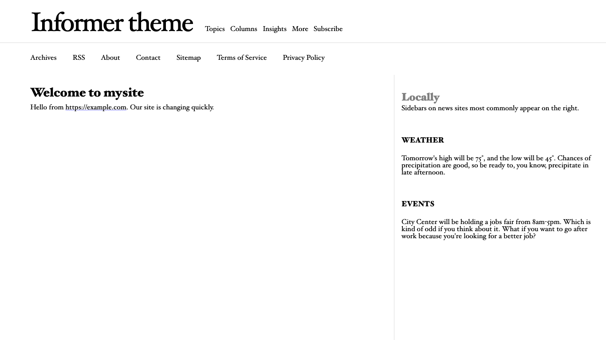
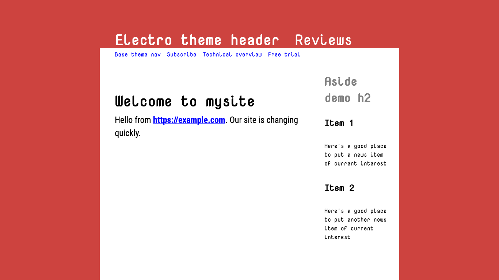

# Changing themes

Recall that we were left with this newly edited page:


We can totally remodel this tiny site with one change.

* Add `theme: informer` between the lines at the top of the `index.md` page:

```
---
title: "Powered with &hearts; by PocoCMS"
theme: informer
---
# Welcome to mysite

Hello from https://example.com. Our site is changing quickly.
```

* Save the file and run poco again. 

Things are looking up!



If you're in dark mode, you will see that the theme automatically takes advantage of it:


That's because it was made with the [PocoCMS theme framework](theme-framework.html),
which has a ton of other advantages, such as automatic mobile support responsive mode,
and other traits to be discussed later.

## Front matter

By the way, you'll note that you can change how the blog looks
by changing things you see in between lines of 3 dashes (`---`)
as shown here:
```
---
title: "Powered with &hearts; by PocoCMS"
theme: informer
---
```

You will have noticed that it doesn't affect the text of the article.
That's because it's technically a separate document called the
[front matter](glossary.html#front-matter). You don't need
front matter in a PocoCMS file, but you'll find it's 
a big part of your existence when changing the look
and format of your websites. Much more about
front matter as lessons progress.

## Trying a few more themes

* Let's look at another theme, Electro:

```
---
title: "Powered with &hearts; by PocoCMS"
theme: electro 
---
```



* Finally, let's choose something generic: the Base theme. 
Base is, well, the basis of all PocoCMS themes that use the [framework](theme-framework.html).

```
---
title: "Powered with &hearts; by PocoCMS"
theme: base 
---
```


###### [Previous: Editing the page](gs-editing-page.html) [Next: Parts of a theme](gs-parts-of-theme.html)
