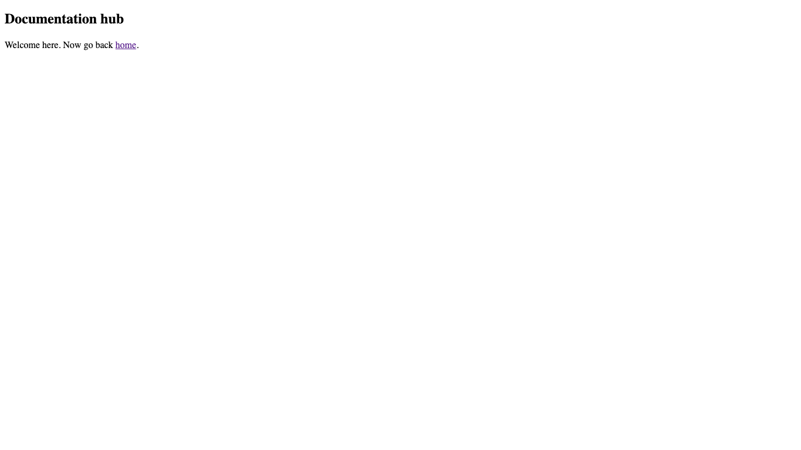

# Creating and linking to pages

So. It's time to start creating the pages for your site. Let's
first learn how [Markdown](glossary.html#markdown) works.
If you're accustomed to Markdown feel free to skip this section.

## Why Markdown?

If you load up the `index.md` file in a site you've
[created](/docs/getting-started.html#create-a-site), you'll
see something along these lines:

```
# Welcome to mysite

hello, world.

Learn more at [PocoCMS tutorials](https://pococms.com/docs/tutorials.html)
```

### A few quick Markdown samples

It's sort of easy to figure out 
roughly how this document will render as HTML
(but if not, don't worry because all this 
and more will be explained in this tutorial).

```
# This is most important

Wait for it..

## This is less important...

Oh, theres' more.

###### And this is way not important

Can you guess that *this* will be *italics*,
and that **this** will be **bold**?
```

Depending on the theme, it renders with the decorated text
showing different formats:


### Markdown has semantic importance

HTML is designed to structure your documents so that readers
(including screen readers for visually compromised people)
can get a feel for how important the parts of a document
are by their formatting. Browsers use HTML to determine
page formatting, along with stylesheets, many of
which are provided by the [PocoCMS theme framework](theme-framework.html)
to get you started.

The heading at the top of this page looks like this in its
original Markdown file:

```
# Creating and linking to pages

```

The `# ` part translates to an HTML `<h1>` tag. 
The tags from `<h1>` to`<h6>` are called headings.
`<h1>` is given the greatest weight, an `<h6>` the least.
Most search engines don't even bother with 
`<h4>` through `<h6>`.

At any rate the title above appears in the finished document
as `<h1>Creating and linking to pages</h1>`.

As you can imagine, the subtitle
`### A few quick Markdown samples` on this page gets rendered
as a level 3 heading: `<h3>A few quick Markdown samples</h3>`

Now let's start creating pages and writing some Markdown.


## Creating a new page

* From your site's [root directory](glossary.html#root-directory),
drop into your command shell and create a subdirectory
called `docs`:

```
mkdir docs
```

* Create the file `docs/index.md` with these contents:

```
# Documentation hub

Welcome here. Now go back [home](/).
```

So we have a new page one subdirectory down. Let's link to
it from the home page.

## Creating Links

* Edit the `index.md` in your root directory to 
include this line:

```
Check out our [Documentation](docs/index.html)
```

* Run poco again to rebuild the site:

```
poco
```


* Click the link you just added, and you should connect
to the new page:




The home page should link to the page you've created in the new subdirectory,
although something's wrong. The theming is gone. Not good. 
test the link while whe're here.

## theme vs pagetheme

* Bring up the home page `index.md` and change the line that starts 
with `pagetheme:` to `theme:`

```
theme: base
```

* Run poco again to rebuild your website, then re-click the link that
says `Check out our Documentation`.

**Even though you made no change to the new page, it is now properly
themed:**


### theme on the home page sets a global theme

If you use `theme` on the [home page](glossary.html#home-page) of your
site, it causes every other page on the site to use that theme
unless otherwise directed by a `pagetheme`.
That way you don't have to type `pagetheme:` into the front matter
of every page of your site.

Using `theme`  won't work on any other page of the site. Just the [home page](glossary.html#home-page) `index.md` or `README.md` in your site's root directory.

The term for this is [global theme](glossary.html#global-theme).

### pagetheme sets the theme on a per-page basis 

So wait, what if you like having a global theme but sometimes
prefer a different theme? You can override the global theme on any other page 
using the familiar `pagetheme`:

```
pagetheme: pasteboard
```

Having cleared that up, let's look into the link we just created 
to the new page, and the link from the new page back to the 
original one.

## Markdown link format

Here's an informal look at link formatting
in Markdown:

* a link is in the format `[Anchor text](url)`, where
`[Anchor text]` is anything you want to put there, surrounded by
part of the link. This visible portion is formally known as [anchor text](https://developer.mozilla.org/en-US/docs/Web/HTML/Element/a) in the HTML world.
* The second part of the link immediately follows the square brackets.
No space is allowed or it won't be interpreted as a link. It's the
part in `(` and `)` *parentheses*. That's the target of the link.
It can be a simple URL to another website, such as `[Google](https://google.com)`, or:
* You can easily indicate a subdirectory below the current one
by giving its name, followed by a slash:
`[Documentation](docs/index.html)`
* Or, if you want to indicate the home page, just use a slash by itself:
`[home](/)`. Or:
* If you're in a subdirectory you can actually open a file in the
directory above it like this:

```
[home](../index.html)

```
  Also there's a shortcut. If the file in the subdirectory above
is index.html, you can omit the filename:

```
[home](..)
```
* You can even link to a named place inside a document if it's been marked
in the original HTML. To look to the word `Markdown` in the PocoCMS
glossary you'd write a link this way: 

```
[Markdown defined](https://pococms.com/docs/glossary.html#markdown)`
```

* To link to a place inside the same document, just us the `#`. For
example, this will link the `Why Markdown` heading in this page:
`[Why Markdown](#why-markdown)` would therefore link to
[Why Markdown](#why-markdown).


## View Source: how to find out where you can link inside another web page

So how do you know what inside parts of a web page you can
link to? In the HTML of the page you'll a notation something like
this, in the case of the `Why Markdown` heading on this page:

```
<h2 id="why-markdown">Why Markdown?</h2>
``` 

If you have a passing acquaintance with HTML you'll know a heading
looks like this:


```
<h2>Why Markdown?</h2>
``` 

The additional `id="why-markdown"` is called a [unique identifier](glossary.html#unique-identifier) and makes it possible for
browsers to find that part of the page:

```
<h2 id="why-markdown">Why Markdown?</h2>
``` 

The whole thing is called a bookmark or [named anchor](glossary.html#named-anchor)

### PocoCMS creates bookmarks for all headings

PocoCMS generates a unique named anchor or bookmark for each [heading](glossary.html#heading) levels, from `<h1>` to `<h6>`. If you have two headings that look the same,
PocoCMS ensures the links are unique. For example, the first level 2 heading
like this:

```
## Why Markdown?
``` 

Generates this HTML:

```
<h2 id="why-markdown">Why Markdown?</h2>
``` 

### Bookmarks have a unique identifier
The additional `id="why-markdown"` is called a [unique identifier](glossary.html#unique-identifier) and makes it possible for
browsers to find that part of the page:

```
<h2 id="why-markdown">Why Markdown?</h2>
``` 
### Unique identifiers are created even if headings repeat

If the heading is repeated within the same document (which is just a bad idea):

```
## Why Markdown?
``` 

The anchor text is generated with a trailing number. Notice the `id="why-markdown-1"`
in the example below of a repeated heading:

```
<h2 id="why-markdown-1">Why Markdown?</h2>
``` 

### View source on Windows: Ctrl+U

* If you're running a Windows machine, you can see the HTML source code
of a web page by holding down the `Ctrl` key and pressing the `u` key
at the same time, an action notated as `Ctrl+U`.
* You can then search for the anchor text, `Why Markdown` in this case,
by pressing `Ctrl+F`. That will get you to the `id=` part you need
to include in your link.

### View source on MacOS: ⌘+U

* If you're using a Macintosh, you can see the HTML source code
of a web page by holding down the `Ctrl` key and pressing the `⌘` key
(also known as the command key) at the same time, an action notated as `⌘-U` or
`Command+U`.
* You can then search for the anchor text, `Why Markdown` in this case,
by pressing `⌘-F`, also known as `Command+F`
That will get you to the `id=` part you need
to include in your link.


### If view source doesn't work

If those things don't work, you need to choose develeper mode for your browser.
That's out of the scope of this document, but you can look it up here:
* [View source on Windows](https://www.google.com/search?q=view+source+on+Windows)
* [View source on MacOS](https://www.google.com/search?q=view+source+on+mac+os)

## Learn more about Markdown

If you'd like to learn more about Markdown basics, see our guide at [Markdown](markdown.html)

###### [Previous: Editing parts of a theme](gs-editing-parts-of-a-theme.html) [Next: Creating a theme](gs-create-theme.html)


