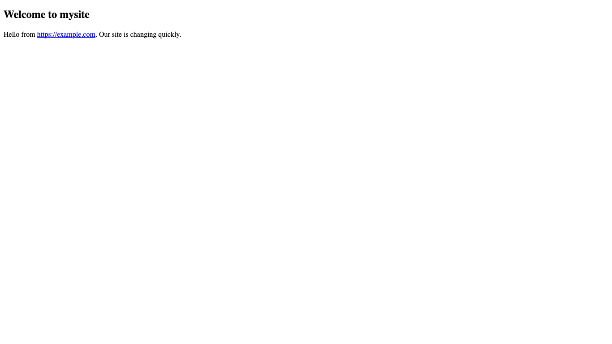

# Editing the page

To make changes to the main part of the web page (the [article](glossary.html#article)), you'll edit the file `index.md`.

* Load `index.md` into your text editor. It looks like this:

```
---
title: "Powered with &hearts; by PocoCMS"
---
# Welcome to mysite

hello, world.

Learn more at [PocoCMS tutorials](https://pococms.com/docs/tutorials.html) 
```

* Delete the line starting with `Learn more`, and `change hello, world`
to something more helpful. In the example below, replace `https://example.com`
with the name of your own website.

```
---
title: "Powered with &hearts; by PocoCMS"
---
# Welcome to mysite

Hello from https://example.com. Our site is changing quickly.

```

* Return to the command line and run poco:

```
poco
```

* Refresh the page. On mobile it would look like this:



Note that web links in the article get turned into into clickable links automatically.

But... this look just has to go. It's not going to impress your audience. Let's change the theme.

###### [Previous: Getting started](getting-started.html) [Next: Changing themes](gs-change-theme.html)
