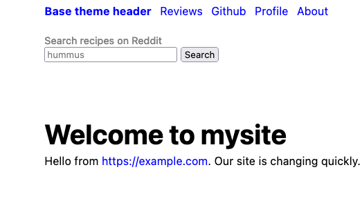
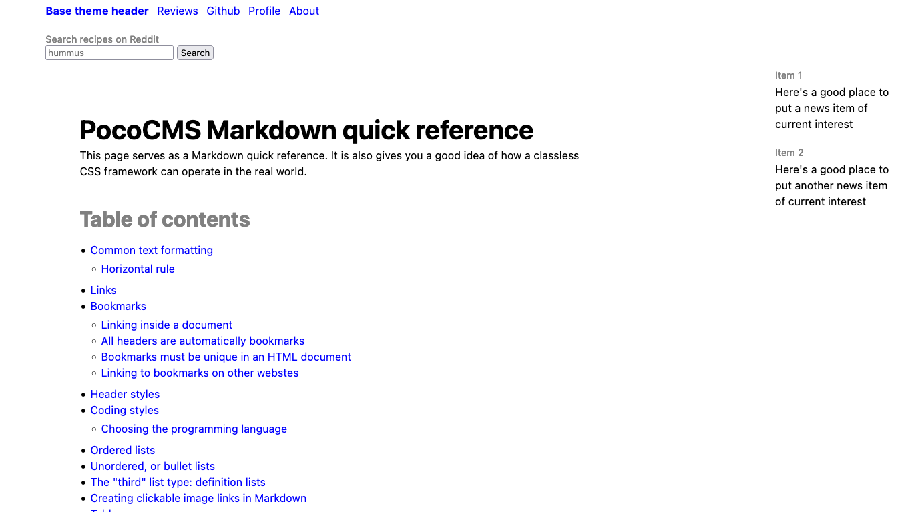

# Editing parts of a theme

You'll always want to change the contents of a theme's header, nav bar, aside, 
and footer. You edit the theme directly to do this, and themes
are designed to make it simple.


* If you're reading this tutorial in sequence you're already in the
root directory, but if not it's easy to find, so 
make sure you get to the [root directory](glossary.html#root-directory).
 
* Load the theme's `README.md` file from your project's by editing the file `.poco/themes/mytheme/README.md`. Obviously
you will replace `mysite` with whatever theme name you created.

It looks something like this:

##### File: **README.md** for a theme

```
---
stylesheets:
- ../../css/root.css
- ../../css/reset.css
- ../../css/sizes.css
- ../../css/layout.css
- ../../css/type.css
- ../../css/mediacolors.css
header: header.md
nav: nav.md
aside: aside.md
footer: footer.md
---

Description of theme...

```

For this section we're interested in the files next to
`header:`, `nav:`, `aside:`, and `footer:`. These are
where PocoCMS gets the contents of those layout elements
when it renders a page into HTML.

To edit them, just add them to the end of the
theme directory. If your theme is called `mytheme`
and you want to edit the header, you would load
`.poco/themes/mytheme/header.md` into your editor.
And we're going to do just that.


## Editing the header

* Load the file `.poco/themes/mytheme/header.md` into your
text editor, replacing `mytheme` with whatever theme
you wish to edit.

It may look something like this:

```
* **[base theme header](#)**
* [Reviews](#)
* [Github](#)
* [Profile](#)
* [About](#)
```

We will look at this mess later, but there's nothing wrong
with simply replacing the name of your site and its
URL in this part: 

```
* **[base theme header](#)**

```

Suppose your company is called Example
and its URL is `example.com`. Here's what you'd do. 

* Replace what's between the `[` and `]` brackets with `Example`.

```
* **[Example](#)**
```

* Replace what's between then `(` and `)` parentheses with
your company's full URL:

```
* **[Example](https://example.com)**
```

Here's the result:


## Replacing the nav

Let's replace the nav and give it the ability to search
[Reddit](reddit.com/r/recipes) for recipes.

* Load the file `.poco/themes/mytheme/nav.md` into your
text editor, replacing `mytheme` with whatever theme
you wish to edit.

The theme's `README.md` will have a line something like this:

```
nav: nav.md
```

In `nav.md`, or whatever file was used to create the nav, 
you'll see the file used to generate the contents of the nav.
Themes have different asides but let's say it looks like this:

##### filename: **nav.md**

```
* [Base theme nav](#)
* [Subscribe](#)
* [Technical overview](#)
* [Free trial](#)
```

* Replace it with this (just copy and paste):

```
#### Search recipes on Reddit 
<form action="https://www.google.com/search" class="searchform" method="get" name="searchform" target="_blank">
<input name="sitesearch" type="hidden" value="reddit.com/r/recipes">
<input autocomplete="on" name="q" placeholder="hummus" required="required"  type="text">
<button class="button" type="submit">Search</button>
</form>
```

* Build your site and you'll see something like this (depends on the theme you
chose, in this case, Base):




### Editing other page layout elements

You can use the principles you've learned on this page to edit your [nav](glossary.html#nav) and  [footer](glossary.html#footer).

### Replacing the contents of the article with a file

You can even replace the on-page text, aka the article.

* Add the following to your root directory's `index.md` file:

```
---
article: ".poco/demo/mdemo.md"
---
```

* Here's what the page looks like now:



The `article: .poco/demo/mdemo.md` line means "take the contents
of the file given after `article: ` and replace the existing 
article with it." It works for any Markdown document, but this
one is useful for demonstrating themes.


###### [Previous: Hiding parts of a PocoCMS theme globally](gs-hide-theme-parts-globally.html) [Next: Creating and linking to pages](gs-creating-and-linking-pages.html)

