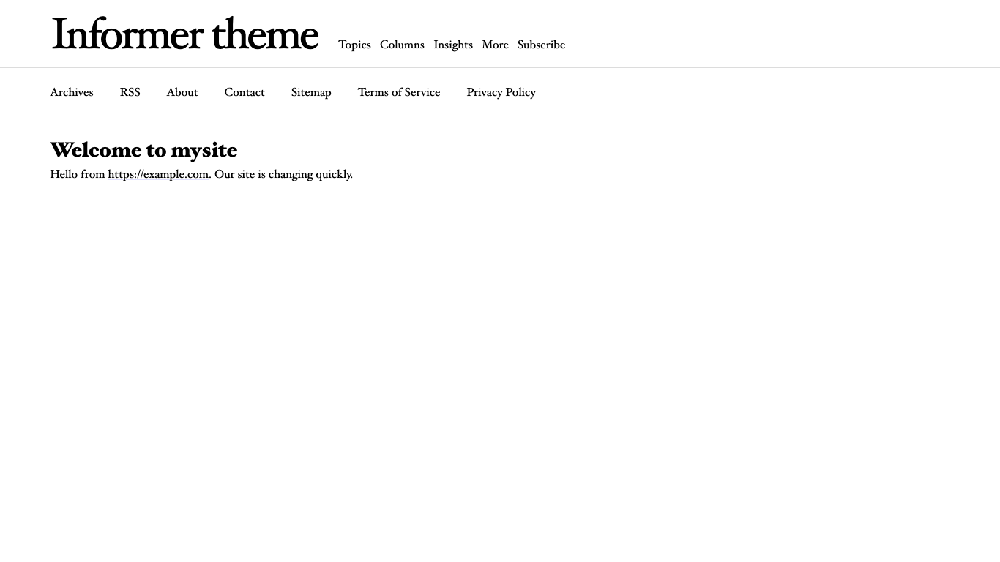

# Hiding parts of a PocoCMS theme globally

In [The parts of a PocoCMS theme](gs-parts-of-theme.html) you learned how
easy it is to hide the header, footer, and other [page layout elements](glosssary.html#layout-element) on a page. What if you just want them gone completely so you don't have 
to use [hide](glossary.html#hide)? What
if you never need or want these in your theme at all? You make a simple
  change to the theme itself.

## Remove header, nav, aside, or footer from a theme

To remove a header, nav, aside, or footer from a theme so you don't have to 
keep [repeating this process on every page](gs-parts-of-theme.html#hiding-header-nav-aside-or-footer-on-a-per-page-basis), just take it out of the theme altogether.

It's a very simple edit and you don't lose anything. You can easily add it back later.

### Find your theme file in the .poco directory

* If you're reading this tutorial in sequence you're already in the
root directory, but if not it's easy to find, so 
make sure you get to the [root directory](glossary.html#root-directory).
 
* Load the theme's `README.md` file from your project's by editing the file `.poco/themes/mytheme/README.md`. Obviously
you will replace `mysite` with whatever theme name you created.
For example, load the Informer them from the root directory
this way: `.poco/themes/informer/README.md` 
* It will look something like this, in the example where your
theme was copied from the Pasteboard theme:

```
---
author: Tom Campbell
branding: Informer
header: header.md
aside: aside.md
nav: nav.md
footer: footer.md

stylesheets:
- ../../css/root.css
- ../../css/reset.css
- ../../css/sizes.css
- ../../css/layout.css
- ../../css/type.css
- ../../css/colors.css
- ../../css/media.css
- "informer.css"
---
```

### Comment out the aside (or any other) page layout element  

Let's say you don't want the aside. Locate this line 
in theme's `README.md`:

```
aside: aside.md
```

And insert a `#` character at the beginning of the line, like this:

```
# aside: aside.md
```

Normally the `aside` is generated from a file. In the above example
that file is named `aside.md`, but that file could be named anything.
The `#` is called a comment. Everything after it is ignored. So
now that line in the theme's `README.md` just never happens.

* Rebuild your site and you'll see the aside is gone, without you
having to [suppress it manually](gs-parts-of-theme.html#hide-the-header).




### Comments in the YAML front matter

It's worth taking a look at comments here, because they're 
useful when you're creating a theme.

The [front matter](glossary.html#front-matter) is in [YAML](yaml-usage.html)
format. Comments in YAML will work on any line of the front matter. 
Here are a few examples of how it might be used.

```
---
# Need something better than just "Informer"
branding: Informer 

# Original theme file is header.md
header: newheader.md

# Disable aside in the theme
#aside: aside.md

stylesheets:
- ../../css/root.css
- ../../css/reset.css
- ../../css/sizes.css
- ../../css/layout.css
# Consider making it a narrow theme
#- ../../css/skinny.css
- ../../css/type.css
- ../../css/colors.css
- ../../css/media.css
- "informer.css"
---
```


###### [Previous: The parts of a PocoCMS theme](gs-parts-of-theme.html) [Next: Editing parts of a themel](gs-editing-parts-of-a-theme.html)

