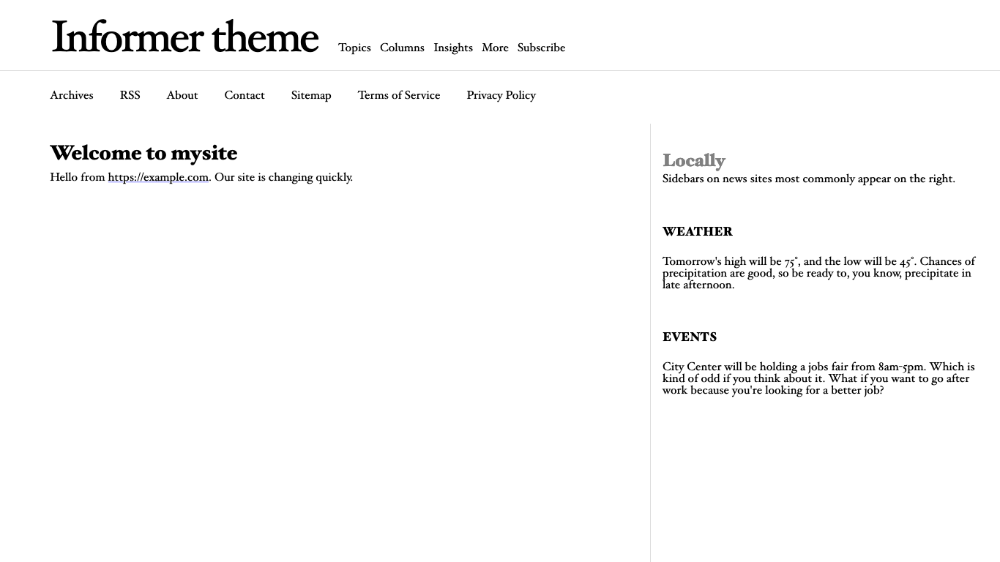
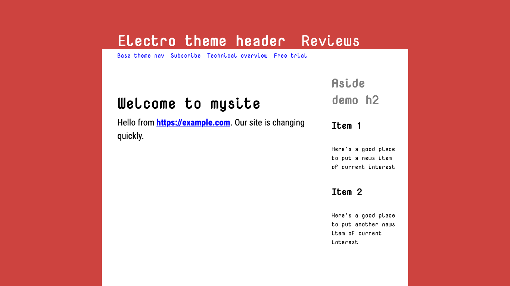
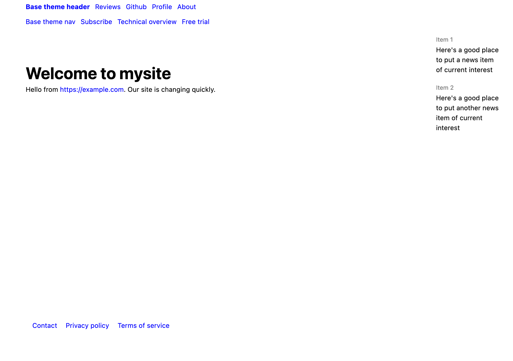
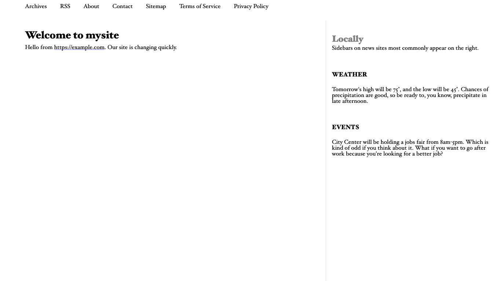
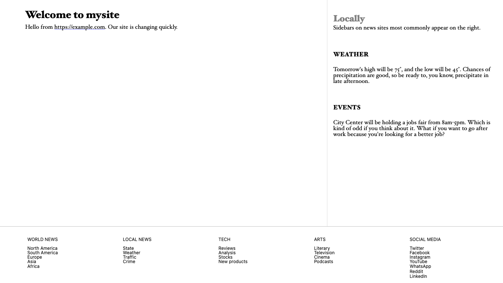
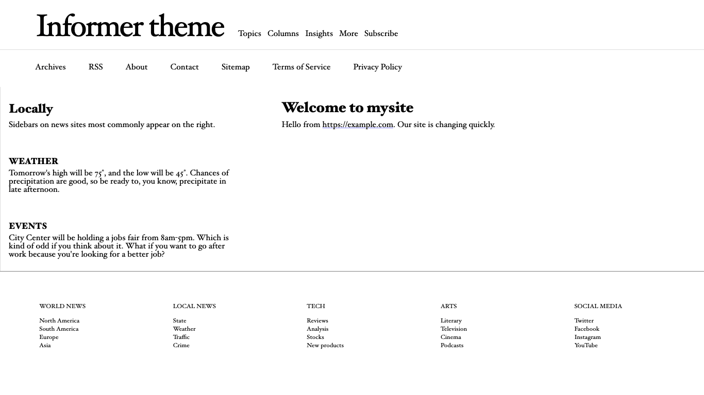

# The parts of a PocoCMS theme

You've learned that you can change themes easily, and that they
can have dramatically different appearances:

##### Theme: **Informer**



##### Theme: **Electro**



##### Theme: **Base**



## Header, nav, article, aside, and footer

As the MDN web docs observe in [Document and website structure](https://developer.mozilla.org/en-US/docs/Learn/HTML/Introduction_to_HTML/Document_and_website_structure) these are the main parts of 
an HTML document:

* [Header](glossary.html#header) (the HTML `<header>` tag)
* [Nav bar](glossary.html#nav) (The HTML `<nav>` tag)
* Main area (PocoCMS calls it the [article](glossary.html#article)) and
it uses the `<article>` tag
* Sidebars (PocoCMS calls it the [aside](glossary.html#aside) because in HTML
it's `<aside>` tag
* [Footer](glossary.html#footer) (the HTML `<footer>` tag

#### Anatomy

This illustration shows these parts of the document using a typical PocoCMS theme:

 

## Layout elements

You will see these parts of the page referred to as [layout elements](glossary.html#layout-element).
Keep these two things in mind about layout elements.

* PocoCMS themes made using the PocoCMS theme framework give you full control over layout elements.
You can hide them on a per-page basis, affect the text on all pages of the site at once,
or change their contents on a per-page basis
* They have [semantic meaning](glossary.html#semantic-meaning)


For a slightly more technical perspective see [HTML layout elements in more detail](https://developer.mozilla.org/en-US/docs/Learn/HTML/Introduction_to_HTML/Document_and_website_structure#html_layout_elements_in_more_detail).

## Hiding header, nav, aside, or footer on a per-page basis

Themes made with the PocoCMS theme framework let you decide on a 
page-by-page basis whether you want to display these layout elements.

### Hide the header

Let's go back to the brief example file we've been using. Make sure
`index.md` looks like this:

```
---
title: "Powered with &hearts; by PocoCMS"
pagetheme: informer
hide: header
---
# Welcome to mysite

Hello from https://example.com. Our site is changing quickly.
```

* Build the site: 

```
poco 
```
* Then refresh the page in your browser.



### Hide the nav

Let's go back to the brief example file we've been using. Make sure
`index.md` looks like this:

```
---
title: "Powered with &hearts; by PocoCMS"
pagetheme: informer
hide: header, nav
---
# Welcome to mysite

Hello from https://example.com. Our site is changing quickly.
```

* Build the site: 

```
poco 
```
* Refresh the page in your browser:



### Hide the rest

You see where this is going:

```
---
title: "Powered with &hearts; by PocoCMS"
pagetheme: informer
hide: header, nav, aside, footer
---
# Welcome to mysite

Hello from https://example.com. Our site is changing quickly.
```

* Build the site: 

```
poco 
```
* Refresh the page in your browser:


A lot of themes look good this way, just the bare naked article.
It definitely focuses the reader's attention.

### Wait, so...?

You nut. Yes, you can suppress the article too. It's sometimes helpful
when working on problems with the look of a theme you're creating.

```
---
title: "Powered with &hearts; by PocoCMS"
pagetheme: informer
hide: header, nav, article, aside, footer 
---
# Welcome to mysite

Hello from https://example.com. Our site is changing quickly.
```

* Build the site: 

```
poco 
```
* Refresh the page in your browser, but no screenshot here. Because,
you know... it's blank. Ah, what the heck.


## Change sidebar direction

One super handy featgure of themes created using the PocoCMS theme framework is that
you can normally choose which side of the page an aside appears on. Just
add `sidebar: left` or `sidebar: right` to the front matter. Note in the
previous images that the aside defaults to the right for the Informer theme.
You can change the side it appears on any page by adding this to the
page front matter:

```
---
pagetheme: informer
sidebar: left
---
# Welcome to mysite

Hello from https://example.com. Our site is changing quickly.
```

Et voilà:




###### [Previous: Changing the theme](gs-change-theme.html) [Next: Hiding parts of a PocoCMS theme globally](gs-hide-theme-parts-globally.html)
