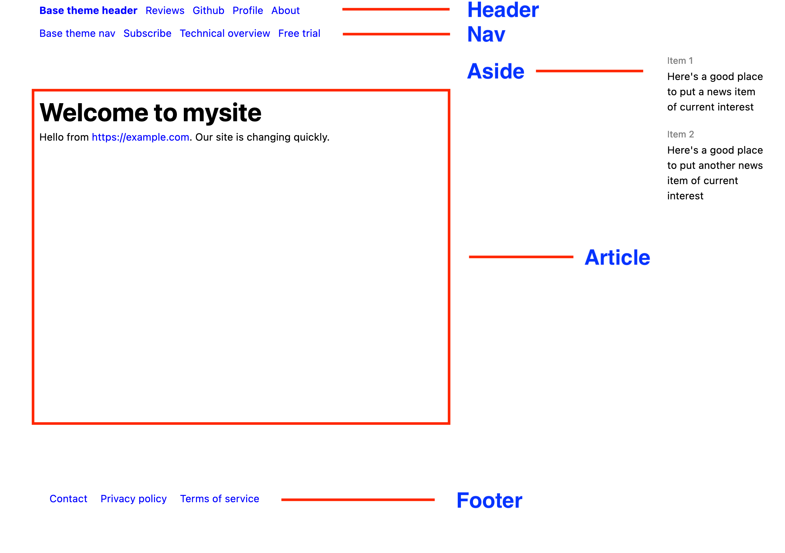

# The parts of a PocoCMS theme

You've learned that you can change themes easily, and that they
can have dramatically different appearances:

##### Theme: **Informer**

##### Theme: **Electro**

##### Theme: **Base**

## Header, nav, article, aside, and footer

As the MDN web docs observe in [Document and website structure](https://developer.mozilla.org/en-US/docs/Learn/HTML/Introduction_to_HTML/Document_and_website_structure) these are the main parts of 
an HTML document:

* [Header](glossary.html#header) (the HTML `<header>` tag)
* [Nav bar](glossary.html#nav) (The HTML `<nav>` tag)
* Main area (PocoCMS calls it the [article](glossary.html#article)) and
it uses the `<article>` tag
* Sidebars (PocoCMS calls it the [aside](glossary.html#aside) because in HTML
it's `<aside>` tag
* [Footer](glossary.html#footer) (the HTML `<footer>` tag

#### Anatomy

This illustration shows these parts of the document using a typical PocoCMS theme:

 

## Layout elements

You will see these parts of the page referred to as [layout elements](glossary.html#layout-element).
Keep these two things in mind about layout elements.

* PocoCMS themes made using the PocoCMS theme framework give you full control over layout elements.
You can hide them on a per-page basis, affect the text on all pages of the site at once,
or change their contents on a per-page basis
* They have [semantic meaning](glossary.html#semantic meaning)

For a slightly more technical perspective see [HTML layout elements in more detail](https://developer.mozilla.org/en-US/docs/Learn/HTML/Introduction_to_HTML/Document_and_website_structure#html_layout_elements_in_more_detail).

###### [Previous: Changing the theme](gs-change-theme.html) [Next: TODO:](gs-TODO)
