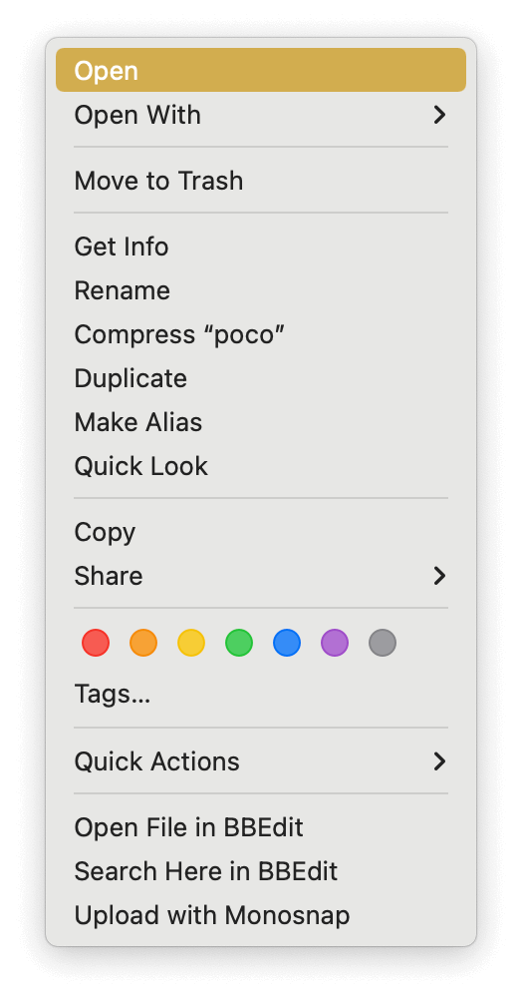
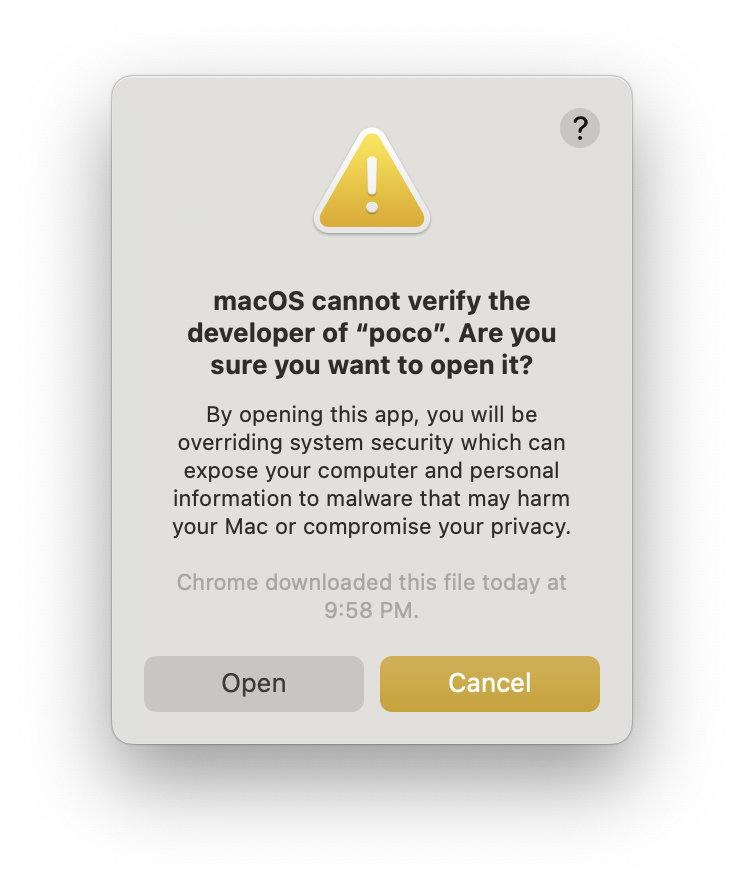

# Macintosh installation help

* Look carefully for the way-to-small **Download** button and click it.

You can't just download and run any old command-line program. You need to give permission to MacOS to open
`poco`. Here's how.

* Open your `Downloads` folder. 

* Click just once on `poco` in the `Downloads` folder. Press and hold down your `Control` key and a context
menu pops up. 

* Click Open.

A dialog appears starting with **macOS cannot verify the developer of "poco". Are you sure you want to open it?**

.

* Open Terminal and change to the 

[Screenshot of MacOS Cannot be Opened dialog](img/cannot-be-opened.png)

* **macOS cannot verify the developer of "poco". Are you sure you want to open it?**
{{- /* install.html#macintosh */ -}}
k
