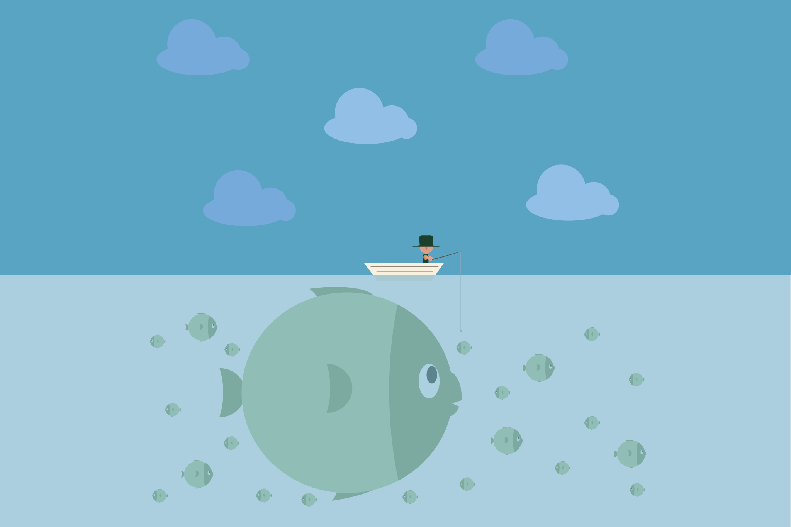

#### WORLD
# Resources: an all-you-can-eat buffet of free and surprisingly useful resources, even for commercial use

This is a curated list of ways to make your web publishing fast and cheaper.
They are all free (some may require attribution or a signup process) and
have withstood the test of time... for a couple of years.

#### **By** [Tom Campbell](https://pococms.com) [@pococms](https://twitter.com/pococms)  | Dec 21, 2022 at 7:30pm



## All resources are free
## Some require attribution
## They're great time savers

## Performance

Paste your site URL into these pages and get the unvarnished truth
about what might be interfering with user experience: from speed to
accessibility to SEO.

* itme
* imt
* tim3

## RANDOM h2

### Google's PageSpeed Insights

Google's [PageSpeed Insights](https://pagespeed.web.dev) is 
like a free consultant. The SEO insights are gold.

### Pingdom's Website Speed Test

When you're testing from the same country your site is
hosted, you may not be getting realistic results.
Pingdom's [Website Speed Test](https://tools.pingdom.com) lets you
see how your site performance from different places on the planet.

## HTML

Sometimes it's convenient and maybe even a little fun to use colors by name instead of
obscure RGB values or hex codes. Modern browsers recognize 140 
[HTML Color Names](https://htmlcolorcodes.com/color-names/), even though official 
web standards admit to only [16](https://www.w3.org/wiki/CSS3/Color/Basic_color_keywords)
(boo, hiss).

## Classless CSS

Here are some promising classless CSS libraries you can
use in your own themes.

* Liam Dougherty's [Theme switcher](https://dohliam.github.io/dropin-minimal-css/) highlighing many good classless CSS resources. Dr. Dougherty is [disgustingly accomplished and productive](https://dohliam.github.io/)

## Type

* The [Inter](https://rsms.me/inter/#charset) font is a new [sans-serif](https://developer.mozilla.org/en-US/docs/Web/CSS/font-family#sans-serif) font designed
designed for clarity.

## Icons

* [icongram](https://icongr.am) made it so simple to get icons
using their amazing API. They offer thousands of icons,
but you can get them in any size and color by specifying
what you'd like on the command line. For example, this
yields a YouTube logo in SVG format, size 32x32 pixels,
in red (color #`FF0000`).

```
https://icongr.am/simple/youtube.svg?size=32&color=FF0000
```

* Don't underestimate the 1800+ [Bootstrap icons](https://icons.getbootstrap.com/),


* [Lucide](https://lucide.dev) open source icons

## SVG graphics

* [SVGViewer](https://www.svgviewer.dev) can remove padding from SVGS, validate them, optimize them,
and more.
* [Vecta Nano](https://vecta.io/nano) compresses SVG files with an online interface

## Other graphic assets

* 
* [CSS Gradient](https://cssgradient.io/) generator goes into more depth than you'd think It has a handy generator on the home page, but then gets into things like [CSS Gradient Text](https://cssgradient.io/blog/css-gradient-text/),  [Gradient Backgrounds](https://cssgradient.io/blog/how-to-create-a-gradient-background/), [Patterns with CSS Gradients](https://cssgradient.io/blog/gradient-patterns/), done-for-you [CSS Gradient Swatches](https://cssgradient.io/swatches/), and  much more.
