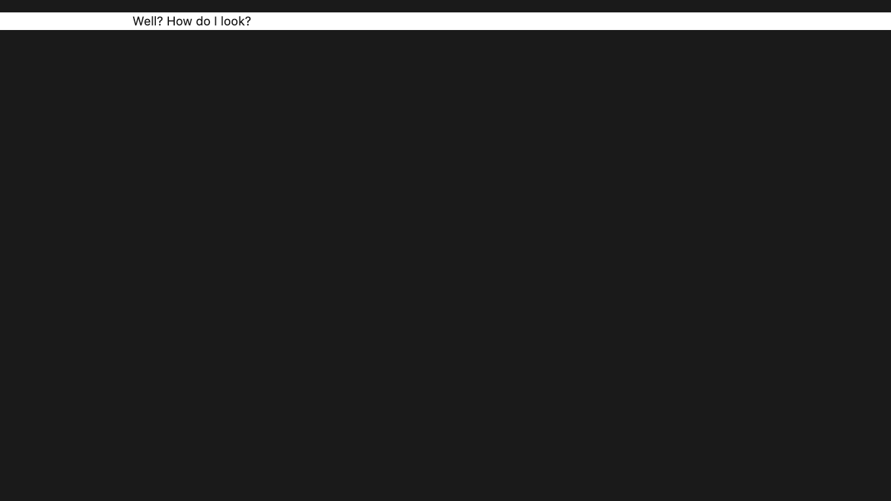
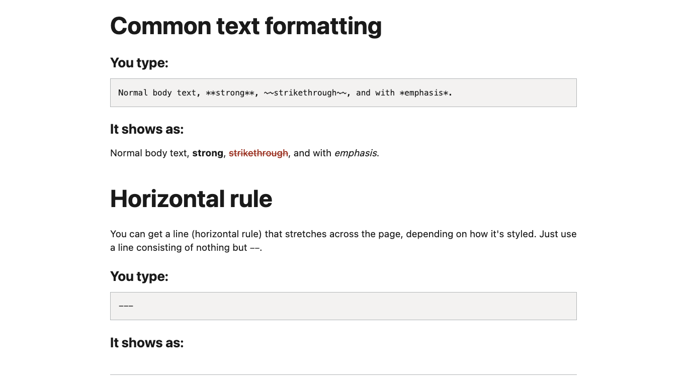
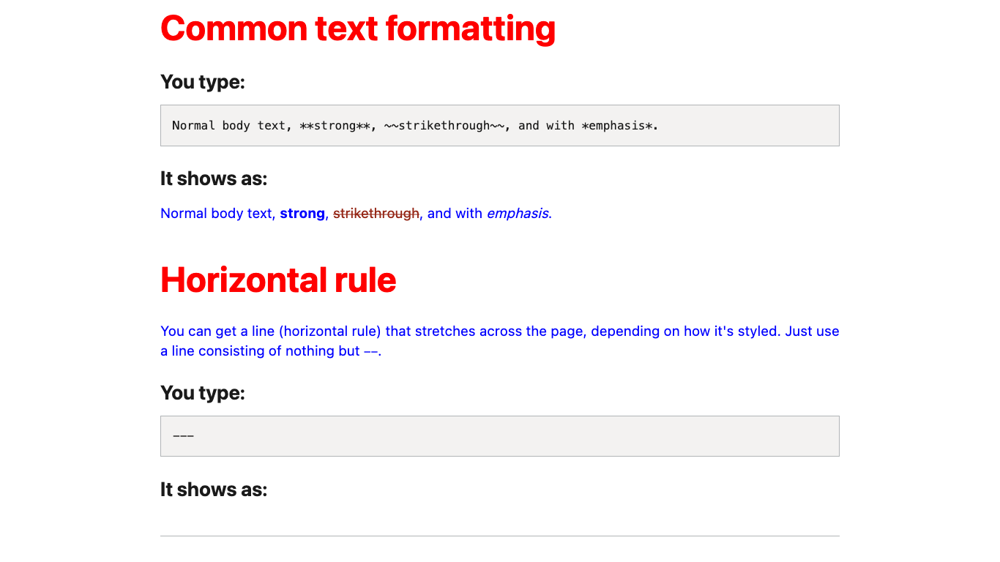
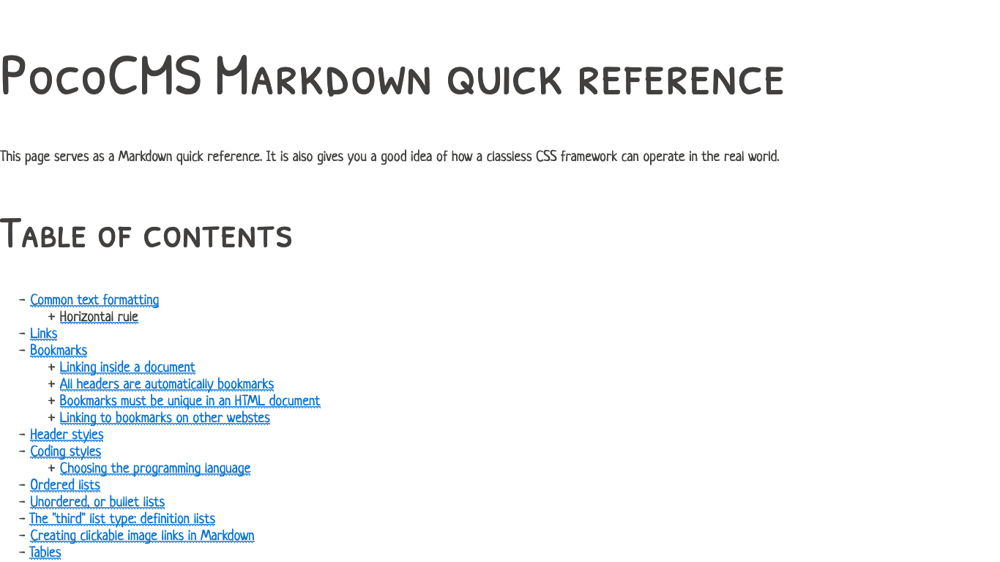

# Adding a classless stylesheet to your theme

There's a genre of stylesheets called "classless" that
produce attractive results with plain HTML, which is
exactly what you need for PocoCMS, which cannot 
add or class designations to its HTML output.

One such stylesheet is [GD.css](https://gdcss.netlify.app/), created by [The Developer's Society](https://www.dev.ngo/).

* Add the following to your `.poco/themes/t1/README.md` file:

##### Filename: **.poco/themes/t1/README.md**

```
---
stylesheets:
- "https://hawkz.github.io/gdcss/gd.css"
---
```

Rebuild your site and hit your browser's refresh button:



Looks promising. Let's use a demo Markdown document created for the purposes
of testing themes. Add the following to your root directory's `index.md` file:

```
---
theme: t1 
article: ".poco/demo/mdemo.md"
---
```
The `article: .poco/demo/mdemo.md` line means "take the contents
of the file given after `article: ` and replace the existing 
article with it." It works for any Markdown document, but this
one is useful for demonstrating themes.

* Scroll down and see how full-featured it is:





### Use the styles rule to update the stylesheet

Adding stylesheets isn't the only thing you can do in
a theme's `README.md`. Another thing you can do is
add overriding (or supplementary) style rules.

* Add the following to your `.poco/themes/t1/README.md` file:

##### Filename: **.poco/themes/t1/README.md**

```
---
stylesheets:
- "https://hawkz.github.io/gdcss/gd.css"

styles:
- "h2{color:red;}"
- "p{color:blue;}"
---
```
* Build your project and scroll through again. You'll see
the changes you made:




Lets' try another classless stylesheet, 
[PaperCSS](https://github.com/papercss/papercss) 
by [Rhyne](https://www.vlaservich.com/).


* Change your `.poco/themes/t1/README.md` file to look like this:

##### Filename: **.poco/themes/t1/README.md**

```
---
stylesheets:
- "https://hawkz.github.io/gdcss/gd.css"
---
```

* Rebuild your project and gaze upon one of the more
original stylesheets of our time:



This one was so fun, and in fact so useful, we used it as the basis
of the [framework](theme-framework.html) theme called
[Paper](https://pococms.com/docs/demos/paper.html).

### These themes are limited

You could build a whole site based on these simple themes,
but you'd lose features like headers, footer, navs, and asides.
You'd probably also lose dark mode support and media queries.

###### [Previous: Creating a PocoCMS theme from scratch](img/th-create-from-scratch.html)

{{- /* [Adding a classless stylesheet to your theme](th-add-classless-css.html) */ -}}


