# Creating a PocoCMS theme with the framework

The best way to create a highly versatile theme
is to use the PocoCMS [theme framework](theme-framework.html).
It's contained entirely in the Base theme and is the
launchpad for all PocoCMS framework themes, from [Electro](demos/electro.html) to
[Clerk](demos/clerk.html) to [Skyscraper](demos/skyscraper.html).

Here's the theme we'll create:


We'll then create a child theme, which inherits the desired qualities of that theme
but can be used for a specialized version. This one will be for a home page for the
previous theme:

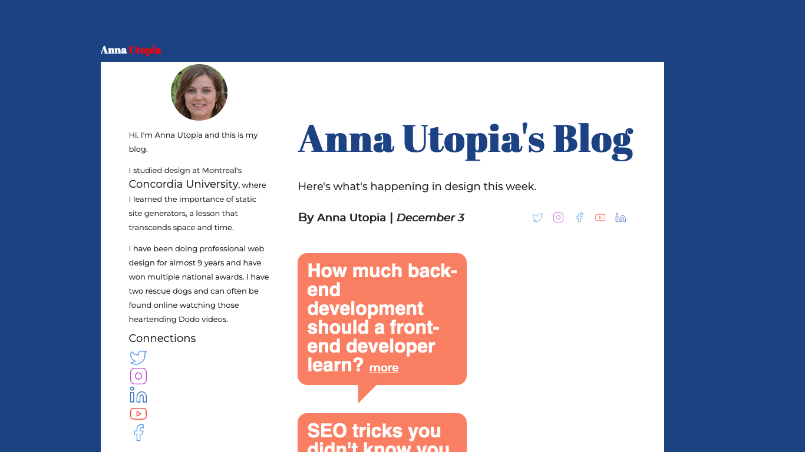

## Overall strategy

The way to create a theme using the theme framework is simple:

* Copy a the directory for a theme you like
* In the new directory, add a stylesheet by the name of that theme 
* Put all theme alterations in that new stylesheet

This guide takes you through every step of the way
to create a theme using that technique.

## Start a new project

Each Poco project is self-contained, with all theme data
contained within the `.poco/themes` subdirectory.
It's easy to copy a theme elsewhere when you're finished
but right now the safest thing to do is to start
with a test project. We'll call it `mytheme`.

```
poco -new test
cd test 
```

## Copy a theme you like

The first thing is to copy a theme you like.

* To copy a theme, choose the theme you want to start with. 
[Base](https://pococms.com/docs/demos/base.html) is the
best place to start. It is a pretty neutral theme meant
to be customized.

* Copy the `base` theme like this:

```
poco -from base -to mytheme 
```
You're then informed:

```
PocoCMS mytheme created
```

##  Append themename.css to end of the theme's stylesheets rule

* Load the theme's `README.md` file from your project's [root directory](#glossary.html#root-directory) by editing the file `.poco/themes/mytheme/README.md`. Obviously
you will replace `mytheme` with whatever theme name you created.
* It will look something like this, in the example where your
theme was copied from the Base theme:

```
---
stylesheets:
- ../../css/root.css
- ../../css/reset.css
- ../../css/sizes.css
- ../../css/layout.css
- ../../css/type.css
- ../../css/mediacolors.css
---
```
* Immediately append the `.css` named after your theme 
to the *end* of the `stylesheets` list:

```
stylesheets:
- ../../css/root.css
- ../../css/reset.css
- ../../css/sizes.css
- ../../css/layout.css
- ../../css/type.css
- ../../css/mediacolors.css
# ADD THE LINE BELOW. Replace gossip with your theme name:
- mytheme.css

```

The contents of the file `.poco/themes/mytheme/mytheme.css` are pretty much blank and
will have no affect on the theme so far:


```
/* OVERRIDE FRAMEWORK SIZES */

/* OVERRIDE FRAMEWORK LAYOUT */

/* OVERRIDE FRAMEWORK TYPOGRAPHY AND FONTS */

/* OVERRIDE MEDIA QUERIES. COLORS FOR LIGHT & DARK THEMES */
@media (prefers-color-scheme:light) {
:root {
}
}

@media (prefers-color-scheme:dark) {
:root {
}
}
```

* Let's test it. 

## Add the theme to your index.md file

* You should be in the directory you just created named `test`. Open the file `index.md`
and add this line to the front matter so you can see the new theme:

```
---
theme: mytheme 
---
```

## Run poco -serve

* Open a new terminal window.
* Change to your test directory
* Run the server:

```
poco -serve
18 Jan 12:34:56 Web server running at:

http://localhost:54321

To stop the web server, press Ctrl+C
```
* Paste the URL `http://localhost:54321` into a browser.

You should see the test site:


Right now we're just at parity with the Base theme. Next
we'll learn about turning Base into something better
for a blog.

The following steps are sort of random; you could do them in any order
and still come out with the same results.


## Create light and dark themes

The theme framework has built-in support for both light and dark themes.
It comes with many sensible defaults but none of them is sacred.
Load `.poco/themes/mytheme/mytheme.css` and let's start like this.
Feel free to copy and paste the code shown below.

```
@media (prefers-color-scheme:light) {
:root {
  --a:var(--html-bg);         /* Default link color */
  --fg:#252627;               /* Default text color */ 
  --bg:white;                 /* Default background color */ 
  --html-bg:#1C4284;          /* Color enclosing skinny themes */
}
}
```

If you're not too familiar with CSS we'll explain what's happening
in a moment.


### Take a look

We'll assume you do the following every time you make a 
change to the theme style sheet. We aren't going to repeat
this instruction because it would get super annoying
to read. So whenever we say something like "take a look" or anytime
you feel it necessary, and more is better when you're using CSS
because minor errors can cause scary-looking problems,
we mean:

* Switch to the terminal window that has your `test` directory current.
* Run poco to rebuild the site (the exact directory shown will be different)

```
poco
Site published to test/WWW/index.html
```
* Switch to the browser you have running the URL `http://localhost:54321` 
* Refresh the page.


### Override CSS styles

Recall that CSS is *cascading*, which means that you can simply add a rule
to replace an old one. You don't have to get rid of the old one. Whichever
rule is encountered most recently is the one that takes priority.

Let's see what's happening in this rule:

```
--bg:white;                 /* Default background color */ 
```

The `--bg` rule says "take the previously defined CSS variable named `--bg` and
replace it with the color white". Where is the original `--bg` rule? It comes
from the stylesheet named [.poco/css/root.css](https://github.com/pococms/poco/blob/main/.poco/css/root.css), which has a number of such
rules. It defines default values that look fine on their own, but which
you're expected to replace as necessary in your theme. As you can see 
in `root.css` and the comment above, it's the default background color for text.

When you see usage such as `background-color:var(--bg);` you'll know
to replace `var(--bg)` with the most recent value of `--bg`, which is
white in this example. 

Why not just say `background-color:white;` and be done with it? Because

1. It's better to limit the number of places that value occurs when you decide to make a change.
2. Replacing direct color names with symbolic values makes it easier to create dark and light themes at the same time.
3. It can be propagated elsewhere, which relates to the first point. Take a look at
this rule, also from `root.css`:

```
--header-bg:var(--bg);      /* Background color of header */
```

This rule says "use the same background for [headers](glossary.html#header) as the article uses". You can change
it anytime, but frequently you'll prefer them to use the same background color.

You'll see it again for the [nav](glossary.html#nav):

```
--nav-bg:var(--bg);         /* Background color of nav */
```

Now you can see a pattern:

```
--a:var(--html-bg);         /* Default link color */
--html-bg:#1C4284;          /* Color enclosing skinny themes */
```

This tells us that the background behind the theme background will be a bluish
color (`#1C4284`), and that links will use that color too.

### Override CSS color rules with root

Put all rules that override CSS variables in the `:root` followed by `{` and `}`. They'll be hoisted to
the top of the priority list. Add this to `.poco/themes/mytheme/mytheme.css`: 

```
:root {
  --a:var(--html-bg);         /* Default link color */
  --html-bg:#1C4284;          /* Color enclosing skinny themes */
  ..etc
}

```

## Create the dark theme

Some users prefer light themes, but others like themes that work better at night.
Browsers and operating systems now have built-in support for dark themes.

* Update the  `@media (prefers-color-scheme:dark)` portio of `.poco/themes/mytheme/mytheme.css` with these dark theme values:

```
@media (prefers-color-scheme:dark) {
  a,footer > a {color:#1B4284;}
  header{color:#1B4284;}
  header > ul > li:first-child > a > del {color:#E63946;} /* Strikethrough text gets different color */
:root {
  --fg:white;                 /* Default text color */ 
  --bg:#044389;               /* Default background color */
  --html-bg:#8EC7D4;          /* Color enclosing skinny themes */
}
}
```

* Set your system to dark mode and take a look:

 

The beginnings of a dark theme... but suddenly the header and footer look like they're missing.
They aren't. Their colors have been overridden and there are background/foreground color clashes.


### Restyle links

Add this just after the comment reading `OVERRIDE MEDIA QUERIES. COLORS FOR LIGHT & DARK THEMES`
and just before the `@media (prefers-color-scheme:light)` code in `.poco/themes/mytheme/mytheme.css`:

```
header,footer {background-color:var(--html-bg);}
header>ul>li>a,header>ul>li>a:hover,header>ul>li>a:active {color:var(--bg)}
header,footer {background-color: var(--html-bg);}
nav ul li a  {color:var(--a);} 
nav a:active,nav a:hover {color:var(--html-bg);}
aside>p> a {color:var(--fg);}
footer>ul>li>a,footer>ul>li>a:hover,footer>ul>li>a:active {color:var(--bg);}
```

* Take a look now:

 

A brief look at what you just did:

**Alter header and footer background colors** Here the header and footer background colors are changed to be the same
as the HTML background, which only matters on [skinny themes](glossary.html#skinny-theme):

```
header,footer {background-color:var(--html-bg);}
```

This isn't a skinny theme yet but it will be soon.

**Change link colors** A quick review. In most themes, everything in the header and footer is a link.
The markup of a header file might look like this:

```
* [Base theme header](#)
* [Reviews](#)
* [Github](#)
* [Profile](#)
```

As you can see, it's a list of links, technically, an HTML [unordered list](https://developer.mozilla.org/en-US/docs/Web/HTML/Element/ul) of links. Normally an unordered list shows a bullet for each item and each item
has its own line in what is known as a block display. (Headings and paragraphs are normally blocks too,
at least in the `<article>` portion of a page.) The vast majority of sites re-style the
unordered list in the nav, header, and footer to appear in a horizontal line without the bullet characters.

Let's break down the CSS.

To restyle the header alone, PocoCMS uses very specific CSS so that only it gets that style. The theme
framework is meant for you to style header, nav, footer, aside, and article separately. In the line below,
you're targeting the `header`, then unordered lists in the header (`<ul>/</ul>`), and individual items
in that list (`<li>/</li>`), and finally links (`<a href...</a>`). And finally, we are setting the
background color of the link to the text background color with `var(--bg)`:

```
header ul li a {color:var(--bg)}
```

The rest continues to restyle header links for when the cursor is held over
the link (`hover`) or when it's clicked (`active`):


```
header ul li a,header ul li a:hover,header ul li a:active {color:var(--bg)}
```

Roughly similar treatments are given to the footer and aside.

## Make it a skinny theme

A [skinny theme](glossary.html#skinny-theme) is one that floats in a separate 
background color or outline. The theme framework makes it simple to add
that quality to your theme. 

* Insert `../../css/medium-skinny.css` this just after `../../css/layout.css` in the 
`stylesheets` portion of your theme README.md file. 
It's at `.poco/themes/mytheme/README.md` (replace
`mytheme` with whatever theme directory name you chose):

```
stylesheets:
- ../../css/root.css
- ../../css/reset.css
- ../../css/sizes.css
- ../../css/layout.css
# Add either this or ../../css/skinny.css just after layout.css:
- "../../css/medium-skinny.css"
- ../../css/type.css
- ../../css/mediacolors.css
- "mytheme.css"
```


If you use `skinny.css` instead of `medium-skinny.css` the article area will be
even more narrow. These files change the margins, which you can think of as 
pushing inward from the outside of the page. Now you see what the `--html-bg` CSS
variable is used for.

Be careful if you tweak these skinny stylesheets. It can get... tricky.

## Add downloadable font for headings

The distinctive font you saw in the illustration of the finished theme is charmingly called
[Abril Fatface](https://fonts.google.com/specimen/Abril+Fatface). The body text is called
[Montserrat](https://fonts.google.com/specimen/Montserrat).

They're both from Google and
are freely usable for commercial purposes. Here's the easiest way to
use a downloadable font that's make publicly available on a CDN like Google's.

Insert this line under `stylesheets` just before `../../css/type.css` in your
theme README.md file at `.poco/themes/mytheme/README.md`:

```
- "https://fonts.googleapis.com/css2?family=Abril+Fatface&family=Montserrat:ital@0;1&display=swap" 
```

The whole `stylesheets` section now looks like this:

##### File: **.poco/themes/mytheme/README.md**

```
stylesheets:
- ../../css/root.css
- ../../css/reset.css
- ../../css/sizes.css
- ../../css/layout.css
- "../../css/medium-skinny.css"
- "https://fonts.googleapis.com/css2?family=Abril+Fatface&family=Montserrat:ital@0;1&display=swap" 
- ../../css/type.css
- ../../css/mediacolors.css
- "mytheme.css"
```

* In `.poco/themes/mytheme/mytheme.css` add the following under 
the `OVERRIDE FRAMEWORK TYPOGRAPHY AND FONTS` comment:

```
/* OVERRIDE FRAMEWORK TYPOGRAPHY AND FONTS */
html * {font-family: 'Montserrat', sans-serif;font-size:large;line-height:1.5rem;}
article>h1,article>h2,article>h3{font-family: 'Abril Fatface', serif;}
header>ul>li> a,header>ul> li:first-child > a > del {
  font-family: 'Abril Fatface', serif;
  text-decoration:none;
}
```

* Look at your progress so far:


This line shows how to change most font attributes at once:

```
html * {font-family: 'Montserrat', sans-serif;font-size:large;line-height:1.5rem;}
```

This line uses the display font Abril Fatface on major headings in the [article](glossary.html#article)
portion of your page, which means it won't change some parts like the header:

```
article>h1,article>h2,article>h3{font-family: 'Abril Fatface', serif;}
```

This changes unordered list elements in the header to use Abril Fatface, 
not to change appearance when treated as a link, and to make those
same changes to any strikethrough usage in the list item in the header 
(more on that later, 
but it's the `header>ul> li:first-child > a > del` part).

```
header>ul>li> a,header>ul> li:first-child > a > del {
  font-family: 'Abril Fatface', serif;
  text-decoration:none;
}
```

## Adjust font sizes

The Base theme is so boring it leaves all headings the same size. 
Let's fix that, because larger headings normally have more 
semantic importance. It's a helpful cue to the reader.

Just under the  `OVERRIDE FRAMEWORK SIZES` comment in `.poco/themes/mytheme/mytheme.css` add this:


```
nav ul li a  {font-size:small;} 
article{padding-top:4rem;padding-right:3rem;}
article>h1,article>h2,article>h3{line-height:1em;}
article>h1 {font-size:4rem;padding-bottom:2rem;}
article>h2 {font-size:3rem;padding-bottom:1.5rem;}
article>h3 {font-size:1.75rem;padding-bottom:1rem;}
article>h4 {font-size:1.25rem;}
article>p, article>ul>li,article>ol>li {line-height:2rem;}
article>ul, article>ol {padding-bottom:1.5rem;}
```

The result is starting to hold more visual interest:


### Change heading font size and padding

You can imagine that these additions make headings in the article bigger
and better spaced:

```
article{padding-top:4rem;padding-right:3rem;}
article>h1,article>h2,article>h3{line-height:1em;}
article>h1 {font-size:4rem;padding-bottom:2rem;}
article>h2 {font-size:3rem;padding-bottom:1.5rem;}
article>h3 {font-size:1.75rem;padding-bottom:1rem;}
article>h4 {font-size:1.25rem;}
```

### Reduce nav height and font size

This makes the nav shorter and with a smaller font, simply for stylistic reasons.
Using `font-size:small` instead of a fixed size makes it easier to scale the
web page for visually impaired users.

```
nav ul li a  {font-size:small;} 
```

### Remember to change article list font size along with paragraph

You will surmise that this changes the line height of the article text:

```
article>p {line-height:2rem;}
```

It's easy to forget that both ordered and unordered lists will look weird
if you don't make the same change. Also it's good to give the bottom
of a list some breathing room, so in sum:

```
article>p, article>ul>li,article>ol>li {line-height:2rem;}
article>ul, article>ol {padding-bottom:1.5rem;}
```

## Make header and footer flush left

This theme left-justifies the header and footer.
Add thise code under the `OVERRIDE FRAMEWORK LAYOUT` comment in `.poco/themes/mytheme/mytheme.css`:
```
/* OVERRIDE FRAMEWORK LAYOUT */
header,footer {padding-left:0;}
footer > ul > li {margin-left:0; margin-right: 1em;}
```

The change is small but noticeable:


## Make aside default to the left 

You may remember that most themes created using the PocoCMS theme framework
let you display the aside on the [left or right side of the article](gs-parts-of-theme.html#change-sidebar-direction). You can ensure it defaults to the side you like by adding two lines
of CSS. It defaults to the right but this blog prefers it on the left.
Under the code you just added in the `OVERRIDE FRAMEWORK LAYOUT` 
comment of `.poco/themes/mytheme/mytheme.css` append these lines:

```
/* Default to article on the right, aside on the left */
article{float:right;clear:right;}    
aside{float:left;}  
```

### Make aside default to the right 

For future reference, 
if you decide you want the aside to default on the right at a future
date, you would reverse the meaning of those lines.
Don't leave it that way for this tutorial. Leave it on the left.

```
/* Article on the left, aside on the right */
article{float:left;clear:left;}
aside{float:right;}
```

Here's how it looks on the left. We'll leave it this way for the
rest of this tutorial.

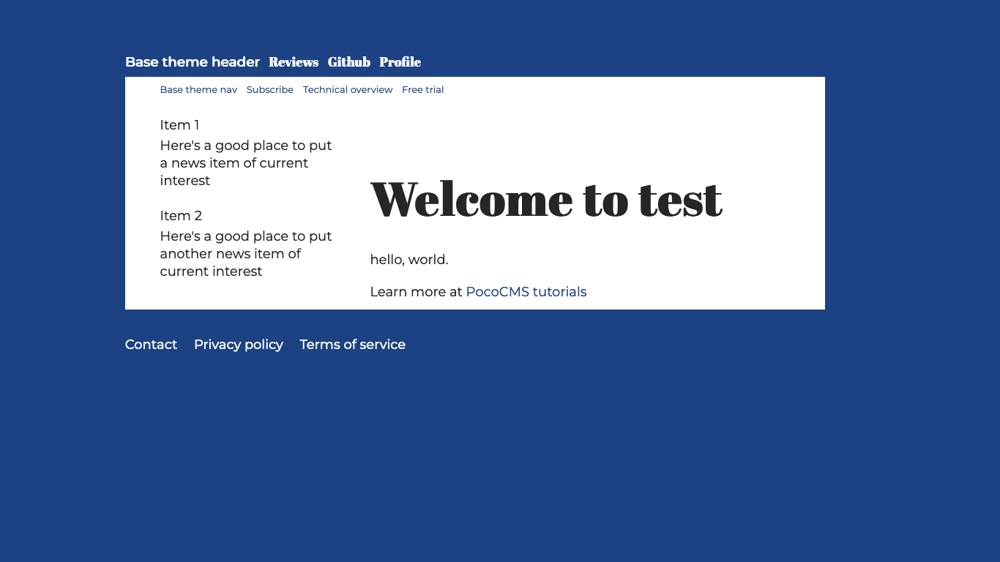

## Add image to the aside

Recall that the aside has a round portrait [on the aside](#creating-a-pococms-theme-with-the-framework).
To get the same effect you'll need a square image of any size. It will be clipped to a 
circle using CSS. There are a few steps to get there.

### Decide on image dimensions

If you just added the image to the aside it would look odd. Let's try that first.

* Open the file `.poco/themes/mytheme/aside.md` and replace its contents with
this line of text:

```

```

(Feel free to supply your own image file in place of `https://cdn.jsdelivr.net/gh/pococms/poco@main/.poco/demo/anna-256x256.jpg`)

Here's what it looks like:

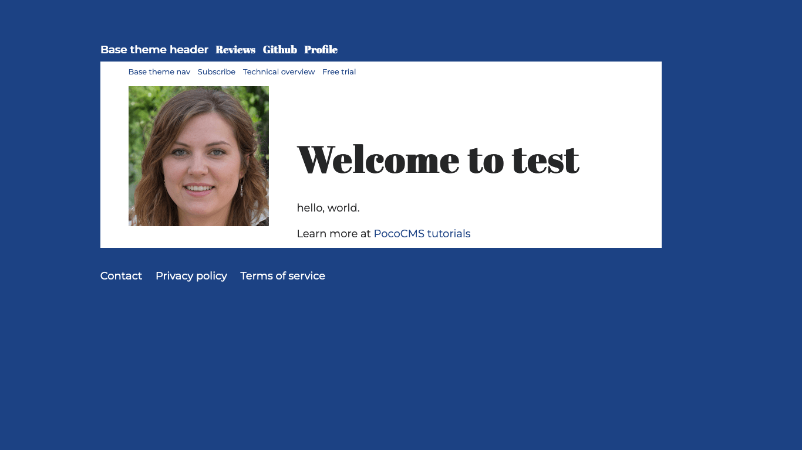

Way too big! That's becuase images by default take up 100% of their containing element.
It makes sense for articles, but probably not for an aside. So we need to shrink
it to fit the aside.

PocoCMS prefers relative image sizes because they're easier to scale, so in this demo we're going
to add a style constraining the image to `6rem` in both length and width.
One `rem` is the height of a character in its containing unit, to simplify.
PocoCMS uses `rem` almost exclusively in its measurements.

Don't add the style yet but it starts out like this:

### Image files always follow a paragraph

One quirk of Markdown is that if you have an image in a Markdown file, it always
follows a paragraph (`<p>` tag in HTML). Which means that this style *will not work*:


```
/* FAIL: constrain image in aside to 6rem x 6rem. */
aside>img {
  width: 6rem;
  height: 6rem;
}
```

At a minimum your style would have to look like this, but we're still not
there yet:


```
/* Constrain image in aside to 6rem x 6rem. */
aside>p>img {
  width: 6rem;
  height: 6rem;
}
```

### Clip image to circle format


You also need to clip the image so it appears in a circle. For various
reasons that are somewhat annoying to get into, you set the
`border-radius` to 50%:

```
/* Round 6rem x 6rem portrait in aside. */
aside>p>img {
  width: 6rem;
  height: 6rem;
  border-radius: 50%;
}
```

It's worth experimenting with `border-radius`, which was largely designed
to created [rounded corners](https://developer.mozilla.org/en-US/docs/Web/CSS/border-radius). 
For example, setting it to `border-radius: .5rem` would show the image as
a box with midly rounded corners.

### Complete style for circular portrait in aside

The completed style is this. Copy and paste this under the `OVERRIDE FRAMEWORK LAYOUT` comment
in `.poco/themes/mytheme/mytheme.css`:
```
/* Round portrait in aside. */
aside>p>img {
  width: 6rem;
  height: 6rem;
  overflow: hidden;
  border-radius: 50%;
  float:none;
  margin: 0 auto;
  text-align:center;
}
```

This is how it should look:

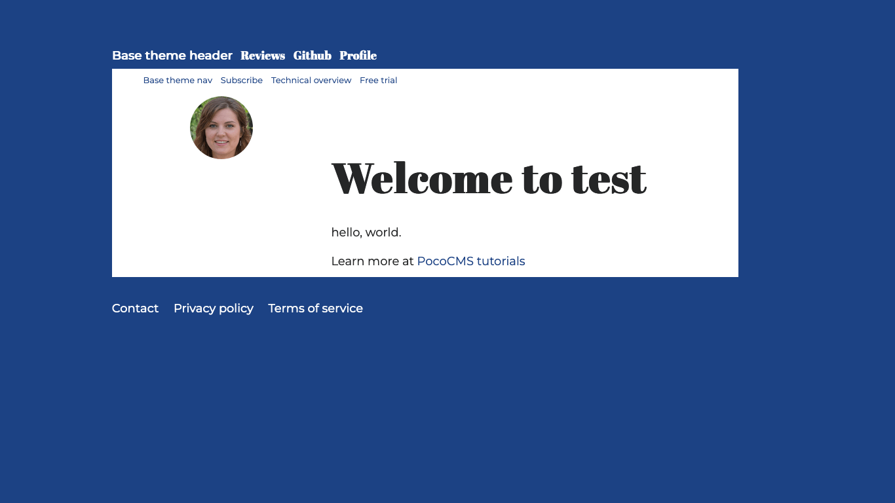


## Adjust font size in aside

In this theme, the aside employs a smaller font size. Under
the `OVERRIDE FRAMEWORK TYPOGRAPHY AND FONTS`
comment in `.poco/themes/mytheme/mytheme.css`, add this override:

##### Filename: **.poco/themes/mytheme/mytheme.css**


```
aside>p{font-size:small;}
```

Append the following sample text to the aside file named `.poco/themes/mytheme/aside.md` after
the image tag, so the file looks like this:

##### Filename: **.poco/themes/mytheme/aside.md**

```


Hi. I'm Anna Utopia and this is my blog.

I studied design at Montreal's [Concordia University](https://www.concordia.ca/),
where I learned the importance of static site generators, a lesson
that transcends space and time.

I have been doing professional web design for almost 9 years 
and have won multiple national awards. I have two rescue dogs and
can often be found online watching those heartending Dodo videos.
```

Here's the aside with text:

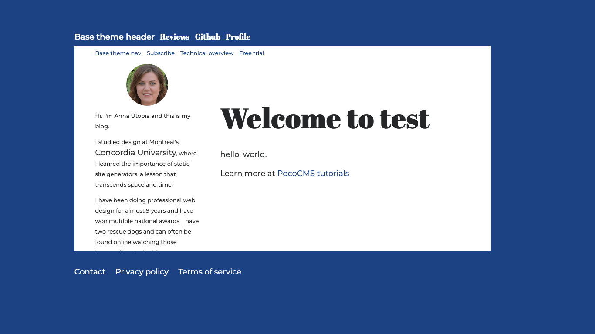

Note that the link text is bigger. That was an accident because an additional
rule should have been added in the CSS to be more specific than
`aside>p{font-size:small;}`, but it looks pretty good. We're leaving it as is.

(But if you wanted to make it boring, you'd add to the `aside` rule
you added a moment ago, you'd add `,aside>p>a` to the
rule like this:)

##### Filename: **.poco/themes/mytheme/mytheme.css**

```
aside>p,aside>p>a{font-size:small;}
```


## Create CSS for column of icons in aside

We are missing the icons in the aside, as shown in 
[Creating a PocoCMS theme with the framework](#creating-a-pococms-theme-with-the-framework)
The markdown for them in `.poco/themes/mytheme/aside.md` shows some challenges.
It looks something like this. You should copy and paste this into a separate document
so you can see all of it at once, but we'll explain it next.

```
###### Connections

[](https://www.twitter.com) [](https://www.instagram.com)   [](https://linkedin.com/)  [](https://youtube.com)  [](https://facebook.com/)   
```

This looks intimidating but it's just a bunch of repeated patterns.

### Clickable image links: a review

Recall from [Clickable image links](md-images-markdown.html#clickable-image-links) that
this is the format of a clickable image link:

```
[](https://example.com)
```

Where:

* `(image-file.ext)` is the filename or URL of the image to click
* `(https://example.com)` is the destination URL the user will click to
*  `alt-text` is the text used for screen readers and doesn't normally display

Here is the Markdown for a complete clickable link:

```
[](https://www.twitter.com)
```

The image file `twitter-24px-blue-outline.svg` in this example can be any image 
file you like, either local or a URL. In the 
theme demo it's actually `../.poco/img/twitter-24px-blue-outline.svg` but it's
easier to show the slightly simplified path for these examples. The whole
list of images creates a column of these clickable links.

When you look at the column of icons in the aside for the finished theme you 
can see they're much smaller than the 6em x 6em we already styled for the
blogger's portrait. How does that happen? It's a key ingredient to the way
PocoCMS themes are created: context.

### How to get different image sizes for the icons in the aside

CSS lets you change an element's CSS based on its relationship with other elements.
If you wondered why the Markdown for the icons included the
line `###### Connections`, it's because the context we are going to
use is a level 6 [heading](glosssary.html#heading) followed by the
icon files, which are image files like any other. They will
appear in a column, one per row.

Here's how we're going to style this column of icons:

```
/* Icons following an h6 in the aside */
aside>h6+p>a>img {
  width: 2rem;
  height: 2rem;
  overflow: hidden;
  float:none;
  margin: 0;
  text-align:left;
}
```

Let's look at this dense little bit of CSS. First is the rule, which
shows its context. The `aside` part means the aside, obviously. The
`h6` means a level 6 heading inside that aside. The `+p` is a slightly
underused CSS rule that means the `<p>` paragraph tag must follow the
level 6 heading immediately. The `>a` following means it's a link,
and finally, the `img` is an image tag. Because it's a link, the
image is therefore clickable.


```
aside>h6+p>a>img {
}
```

The icons will be twice the size of a letter in the aside in both
horizontal and vertical dimensions, hence this code:

```
aside>h6+p>a>img {
  width: 2rem;
  height: 2rem;
}
```

The rest is pretty straightforward. `float:none` means it
will be displayed with a new line following it. `margin:0` makes sure there's no space pushing
in from the outside. `text-align:left` does just that, makes
sure the icon stays to the left.

```
aside>h6+p>a>img {
  width: 2rem;
  height: 2rem;
  float:none;
  margin: 0;
  text-align:left;
}
```

The result is that no matter how many of these image links are
situated next to each other, they'll be displayed one per row,
in a left-justified column. So let's add it to the theme CSS file:
at `.poco/themes/mytheme/mytheme.css`:

##### Filename: **.poco/themes/mytheme/mytheme.css**

* Add the following text after the `OVERRIDE FRAMEWORK LAYOUT` comment:

```
/* Icons following an h6 in the aside */
aside>h6+p>a>img {
  width: 2rem;
  height: 2rem;
  float:none;
  margin: 0;
  text-align:left;
}
```

* Append this text to `.poco/themes/mytheme/aside.md`:

##### Filename: **.poco/themes/mytheme/aside.md**

```
###### Connections

[](https://www.twitter.com) [](https://www.instagram.com)   [](https://linkedin.com/)  [](https://youtube.com)  [](https://facebook.com/)   
```

And it now looks like this:

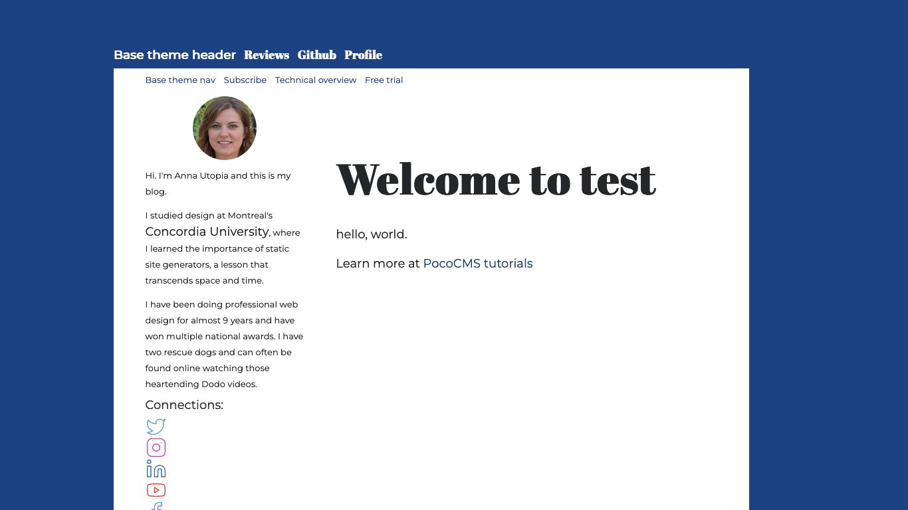

### Add a row of images to the article byline

Look at the byline on the finished theme:

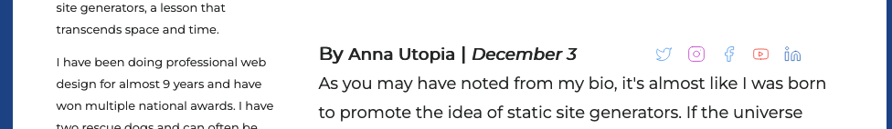

It shows a row of clickable images next to each other *on the same line as a level 4 heading*.
We've gone through some of the basics of images in CSS so let's take a look at the style we'll
be using.

```
/* Social media icons hang to right of level 4 heading text */
article>h4>a>img{
  clear:none;
  float:right;
  margin-right:1rem;
  margin-top:.2rem; 
  height:1.2rem;
  width:1.2rem;
}
```

You now know that the rule `article>h4>a>img` applies to a link inside level 4 heading with an
image: a clickable link. `height:1.2rem;width:1.2rem;` tells you that the icon
is 1.2 times the height of the character in both vertical and horizontal dimensions,
keeping it square. You can put any size image there and it will be exactly 1.2rem square.


`margin-right:1rem;margin-top:.2rem;` fine-tune the spacing around the icon and aren't
very interesting.

The special sauce is here:

```
clear:none;
float:right;
```

[float:right](https://developer.mozilla.org/en-US/docs/Web/CSS/float) causes the image to float to the right of the level 4 heading text. 
There is an odd side effect of the `float:right` we'll discuss in a moment. 

Normally an image would be displayed on a line by itself. [clear:none](https://developer.mozilla.org/en-US/docs/Web/CSS/clear) means the image isn't moved below the level 4 heading that precedes it.

* Add the CSS we've been studying under the `OVERRIDE FRAMEWORK LAYOUT` in
`.poco/themes/mytheme/mytheme.css`:

Filename: **.poco/themes/mytheme/mytheme.css**

```
/* Social media icons hang to right of level 4 heading text */
article>h4>a>img{
  clear:none;
  float:right;
  margin-right:1rem;
  margin-top:.2rem; 
  height:1.2rem;
  width:1.2rem;
}
```

* Copy and paste this to replace the contents of your home page at `index.md` in your [root directory](glossary.html#root-directory):

Filename: **.index.md**

```
---
pagetheme: mytheme
hide: nav
aside: aside.md
---
##### Blog

# Static Site Generators


#### By **Anna Utopia** | *December 3*   [](https://linkedin.com/) [](https://youtube.com/@pococms/)   [](https://facebook.com/)   [](https://www.instagram.com/)  [](https://www.instagram.com)

As you may have noted from my bio, it's almost like I was born to
promote the idea of static site generators. If the universe actually
were a simulation, I would be a character designed solely to move
the idea of static site generators forward.
```

And the result is as it will be on the finished theme, although other elements on 
the page are still unfinished:

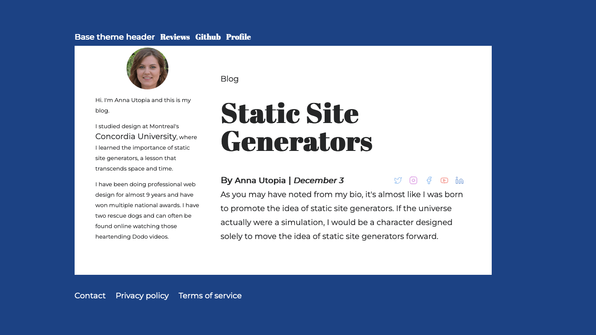

## Complete header styles

If you look back the [picture of the finished theme](#creating-a-pococms-theme-with-the-framework)
you'll see the header is minimalistic, but manages to get two colors out of
the header link. Let's see how that's done.

* Add this code to `.poco/themes/mytheme/mytheme.css` after the comment `OVERRIDE MEDIA QUERIES. COLORS FOR LIGHT & DARK THEMES`:

### Alter style for first list item in header only

Filename: **.poco/themes/mytheme/mytheme.css**:

```
header > ul > li:first-child > a > del {color:red;}
```

This code says that for a link (the `a` part) embedded in 
an unordered list (the `ul > li` part), but only for the
first such linnk (the `:first-child part), and all of this
only within the `header`, color the striketrough text (the `del` part) red.
Normally you would want to add `text-decoration:none` next to the 
`color:red;` part but that's been specified elsewhere in a general
rule that deprives links of their text decoration.

This abuses sematic CSS a little bit to let you use the markup `Anna ~~Utopia~~` for the
blog header. That's the markdown extension for strikethrough text. In the case of the 
blog header, and only the blog header, the text that normally appears to be
struck through with lines crossing out the name will instead appear in red.

Because it works on only the first occurrence (`first-child`), the accent color for the blog
title would appear only on the first element in the unordered list markup shown here:

```
# Utopia is in separate color 
* [Anna ~~Utopia~~](#)
# Blog is NOT in separate color
* My [~~Blog~~](#)
```

### Update header.md

Let's see how the revised header style will look. It's time to fix the header Markdown.

* Replace the `header.md` file at `.poco/themes/mytheme/header.md` with the following:

##### Filename: **.poco/themes/mytheme/header.md**

```
* [Anna ~~Utopia~~](#)
```

And take a look at your work.

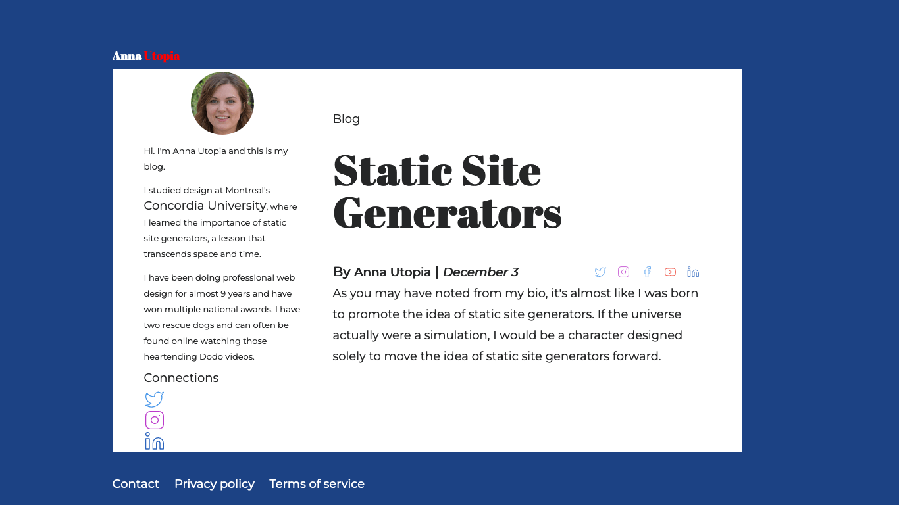


### Add remaining stylesheet code

There are a few random lines to add to your CSS, none of which has particular
teaching value, but we'll explain them quickly.

* Add this code to `.poco/themes/mytheme/mytheme.css` after the comment `OVERRIDE MEDIA QUERIES. COLORS FOR LIGHT & DARK THEMES`:

```
article>h1,article>h2,article>h3{color:var(--html-bg);}
aside > p > a:hover {
  text-decoration:underline;
  text-decoration-color:var(--html-bg);
  -webkit-text-decoration-color:var(--html-bg);
}
footer  a {color:var(--bg);}
```

* The `article` line changes headings `h1`, `h2`, and `h3` to use the HTML
background color as the heading foreground (text)  colors.
* The `aside > p` code changes the text decoration, only for links in the
aside, to show active links with an underline the same color as the HTML background
color.
* The `footer` line makes links in the footer use the article background color.

## The burger menu

The PocoCMS theme framework supports [hamburger menus](glossary.html#burger-menu), which replace the 
header at mobile sizes to save space on your screen. Let's take a look.

* Drag the corner of your web page inward to narrow its width to mobile phone size.

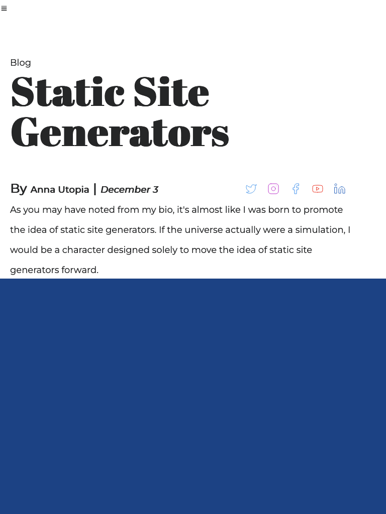

As you can see, the header is replaced by an icon that supposedly looks a bit like a hamburger,
so it's called the *hamburger* or *burger* menu.

* Click the burger menu icon.

A new menu appears, different from the one in the wide version of the header.

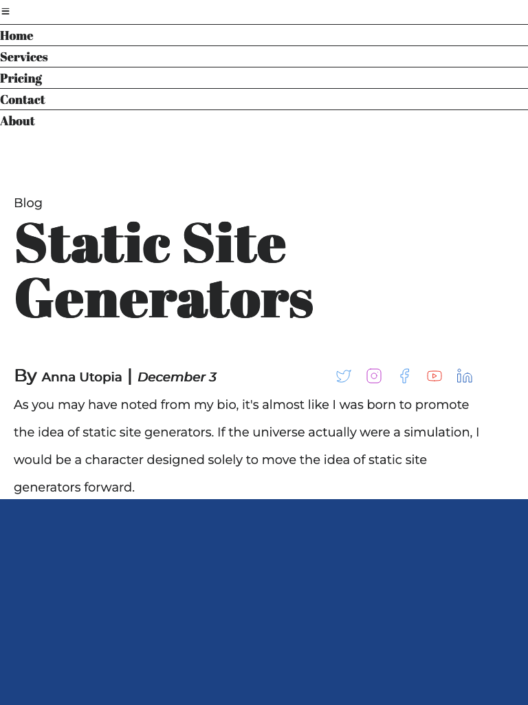

You can alter the appearance of the burger menu. First let's replace the icon with something
understandable, like, say... the word `menu`.

### Replace burger menu icon with text

Find the `burgericon:` line in your theme README.md file at `.poco/themes/mytheme/README.md`:


##### Filename: **.poco/themes/mytheme/README.md**

```
burgericon: "&#9776;"
```

The HTML Unicode value is just [one way to represent](https://unicode-table.com/en/2630/)
the hamburger icon, but we're going to nuke it completely and replace it with a word.

* Change the value of the `burgericon:` rule in your theme README.md file at `.poco/themes/mytheme/README.md`
to the word `menu`:

##### Filename: **.poco/themes/mytheme/README.md**

```
burgericon: "menu"
```

### Reverse the burger menu icon colors

* Add this code to `.poco/themes/mytheme/mytheme.css` after the comment `OVERRIDE MEDIA QUERIES. COLORS FOR LIGHT & DARK THEMES`:

```
:root {
  --burger-menu-padding:1em;
  --burger-menu-fg:var(--bg);
  --burger-menu-bg:var(--fg);
}
```

It's not in either the dark or light theme sections because it applies to both.

* Look at the burger menu now:

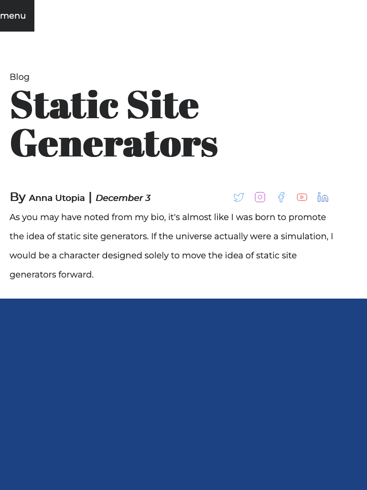

### Edit the burger menu links

Let's imagine that this blog needs different links for the burger menu.

* Open the file `.poco/themes/mytheme/burger.md`, which is pointed to by the `burger` portion of your theme README.md file. 

The file can be named anything, for example. `newburger.md`, as long as you change the
file `burger` points to. By convention the PocoCMS theme framework just uses the name
of the layout element as its filename.

The contents are an [unordered list](md-lines-lists-blocks.html#markdown-unordered-list-syntax) of 
links, same as most headers and navs.

##### Filename: **.poco/themes/mytheme/burger.md**

```
- [Home](/)
- [Services](#)
- [Pricing](#)
- [Contact](#)
- [About](#)
```

* Edit the list like this. Feel free to replace these links with your own.

##### Filename: **.poco/themes/mytheme/burger.md**

```
* [Home](/)
* [Graphic design](#)
* [Themes for sale](#)
```

Here are the new links:

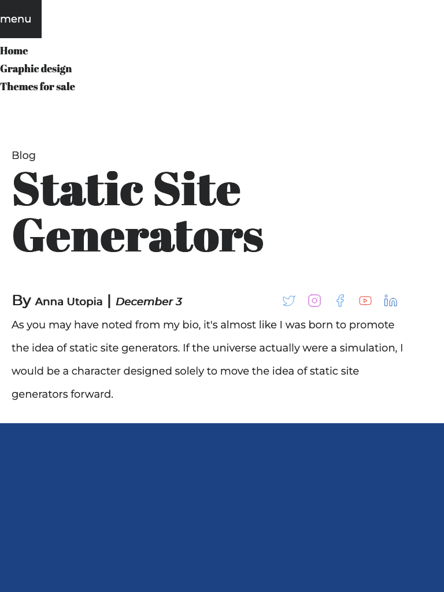

## Create and use a child theme

Sometimes you want a variation on a theme. You want it to inherit most
of the properties of the main theme, but change some of them for a particular
effect. These are called The most common case is for a home
page that serves more as an advertisement than as documentation. This is sometimes
called a *landing page*. The home page of this site uses such a theme, called
`hero`. It's a child of the [pocodocs](https://pococms.com/docs/demos/pocodocs.html) 
theme. To use the `hero` child theme, you'd add this to the page  front matter:

```
pagetheme: pocodocs/hero
```

This section shows how to create a child theme named `home`, for the
`mytheme` theem createdd earlier in this tutorial. That means it
will live in the directory `.poco/mythemes/home`. The steps to create it are:

* [Create a subdirectory for the theme in the theme directory](#create-a-subdirectory-for-the-child-theme)
* [Copy the existing stylesheets and page layout files to that subdirectory](#copy-the-existing-stylesheets-and-page-layout-files-to-the-child-theme-directory)
* [Change relative directory paths to CSS and page layout files required in the theme files](#change-relative-directory-paths-to-css-and-page-layout-files)

* [Create a stylesheet file by the name of the child theme and add or edit styles as needed](#create-a-stylesheet-file-by-the-name-of-the-child-theme-and-add-or-edit-styles-as-needed)
* [Update styles in the new themename.css file](#update-styles-in-the-new-themenamecss-file)
* [Create or copy a LICENSE file](#create-or-copy-a-license-file)

The new `home` theme will create pages that look like this:

<a id='hometheme'></a>


It replaces the level 2 header style in the theme with speech balloons, designed to
draw the reader in by simplifying the home page presentation and offering only a few
choices.


### Create a subdirectory for the child theme

* All PocoCMS themes live in a theme directory.
Child themes live in a subdirectory off the theme directory.
Since `mytheme` lives in `.poco/themes/mytheme`, create the new
directory.

##### MacOS

```
mkdir .poco/themes/mytheme/home
```

##### Windows

```
mkdir .poco\themes\mytheme\home
```

### Copy the existing stylesheets and page layout files to the child theme directory 

Themes are mostly made up of stylesheets, such as `root.css`, and page layout files,
such as `header.md`. Copy those files from the theme to the child theme.

##### MacOS

```
cp .poco/themes/mytheme/*.* .poco/themes/mytheme/home
```

##### Windows

```
copy .poco\themes\mytheme\*.* .poco\themes\mytheme\home
```


###  Change relative directory paths to CSS and page layout files

The child theme's [theme README](glossary.html#theme-readme) file lists CSS files it requires.
Many of them live in the `.poco/css` directory. Because
themes usually share these files, they use operating system relative paths
in the `stylesheets` list, like this:

```
stylesheets:
- ../../css/root.css
```

(If you're not too familiar with relative directories, learn more 
in [Theme structure](https://pococms.com/docs/technical-overview.html#theme-structure).)

Because the child theme is one directory deeper in the directory hierarchy,
relative paths like the one above need to be updated with an additional `../`
path separator:

```
stylesheets:
- ../../../css/root.css
```

Let's take care of the whole theme README now.

* Open the file `.poco/themes/mytheme/home/README.md`

* Any path starting with `../` is a relative path separators. Insert 
another `../` in front of it. You also need one in front of `mytheme.css`
(or whatever you called your theme). Change all of the following to look as follows.

##### Filename: **.poco/themes/mytheme/home/README.md**

```
- ../../../css/root.css
- ../../../css/reset.css
- ../../../css/sizes.css
- ../../../css/layout.css
- ../../../css/medium-skinny.css
- ../../../css/type.css
- ../../../css/mediacolors.css
- ../mytheme.css
```

**Do not** add it in front of the item starting with `https://fonts.googleapis.com..etc`, because
it's not a relative filesystem path. It's a URL and has nothing to do with anything on your machine.

### Create a stylesheet file by the name of the child theme and add or edit styles as needed

The way to create a [theme framework](theme-framework.html) theme is to include the 
standard stylesheets (above), then add a new CSS file by the name of the new theme.
It's not required, but it makes reading through someone else's theme easier to follow.
Therefore, add a new file named `home.css` to the list: 

##### Filename: **.poco/themes/mytheme/home/README.md**

```
- ../../../css/root.css
- ../../../css/reset.css
- ../../../css/sizes.css
- ../../../css/layout.css
- ../../../css/medium-skinny.css
- "https://fonts.googleapis.com/css2?family=Abril+Fatface&family=Montserrat:ital@0;1&display=swap" 
- ../../../css/type.css
- ../../../css/mediacolors.css
- ../mytheme.css
# ADD THIS FILENAME TO THE LIST:
- home.css
```

### Update styles in the new themename.css file 

By convention when you create a new theme, you create a CSS file with new
or overriding styles by the name of that theme, with `.css` appended.

Let's actually create the `.poco/themes/mytheme/home.css` file.

##### Filename: **.poco/themes/mytheme/home/home.css**

```

/* Bubble background color. Works on both light and dark themes.  */
:root {
  --accent-bg:#FA7E61;
}

/* Body of the speech bubble */
article > h2 {
  font-family:sans-serif;
  font-size:2rem;
  color:var(--bg);
	margin-top:3rem;
  padding:1rem;
  position: relative;
  height:auto;
  width:50%;
	background: var(--accent-bg);
	border-radius: .5em;
}

/* Tail of the speech bubble */
article > h2:after {
  content: '';
	position: absolute;
	bottom: 0;
	left: 40%;
	width: auto;
	height: auto;
	border: 1.5em solid transparent;
	border-top-color: var(--accent-bg);
	border-bottom: 0;
	border-left: 0;
	margin-left: -.8rem;
	margin-bottom: -2rem;
}

/* Link within the speech bubble */
article > h2 > a {
  color:var(--bg);
  text-decoration:underline;
}
```

### Create or copy a LICENSE file

Each theme requires a file named LICENSE (all uppercase, no file extension) 
specifying the terms under which your theme can be redistributed.  Feel free to copy one from an existing theme, such as [this one](https://raw.githubusercontent.com/pococms/poco/main/.poco/themes/base/LICENSE) or copy and paste from here. Be sure to update the year and name.

##### Filename: **.poco/themes/mytheme/home/LICENSE**

```
MIT License

Copyright (c) 2023 Tom Campbell 

Permission is hereby granted, free of charge, to any person obtaining a copy
of this software and associated documentation files (the "Software"), to deal
in the Software without restriction, including without limitation the rights
to use, copy, modify, merge, publish, distribute, sublicense, and/or sell
copies of the Software, and to permit persons to whom the Software is
furnished to do so, subject to the following conditions:

The above copyright notice and this permission notice shall be included in all
copies or substantial portions of the Software.

THE SOFTWARE IS PROVIDED "AS IS", WITHOUT WARRANTY OF ANY KIND, EXPRESS OR
IMPLIED, INCLUDING BUT NOT LIMITED TO THE WARRANTIES OF MERCHANTABILITY,
FITNESS FOR A PARTICULAR PURPOSE AND NONINFRINGEMENT. IN NO EVENT SHALL THE
AUTHORS OR COPYRIGHT HOLDERS BE LIABLE FOR ANY CLAIM, DAMAGES OR OTHER
LIABILITY, WHETHER IN AN ACTION OF CONTRACT, TORT OR OTHERWISE, ARISING FROM,
OUT OF OR IN CONNECTION WITH THE SOFTWARE OR THE USE OR OTHER DEALINGS IN THE
SOFTWARE.
```
For more on LICENSE files, see GitHub's [Adding a license to a repository](https://docs.github.com/en/communities/setting-up-your-project-for-healthy-contributions/adding-a-license-to-a-repository).

### Update your home page to use the new child theme

* Let's replace the home page to use the new theme.

```
---
pagetheme: mytheme/home
hide: nav
---

#  Anna Utopia's Blog

Here's what's happening in design this week.

#### By **Anna Utopia** | *December 3*   [](https://linkedin.com/) [](https://youtube.com/@pococms/)   [](https://facebook.com/)   [](https://www.instagram.com/)  [](https://www.instagram.com)

## How much back-end development should a front-end developer learn? [more](#)

## SEO tricks you didn't know you knew [more](#)

## Are CSS preprocessors really necessary? [more](#)
```

The results should look like the picture of your theme [here](#hometheme).

## You're done!

That's the end of this tutorial. Master what you've followed so far and you are ready to

* Create a complete informational website
* Modify themes
* Create themes from scratch

Have fun!


