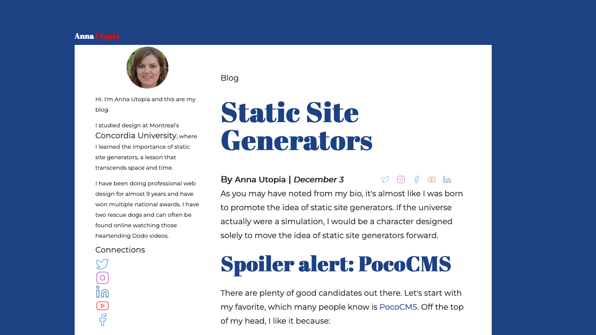
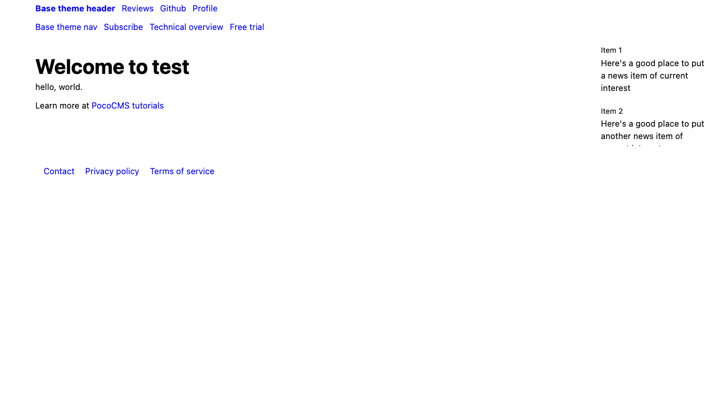
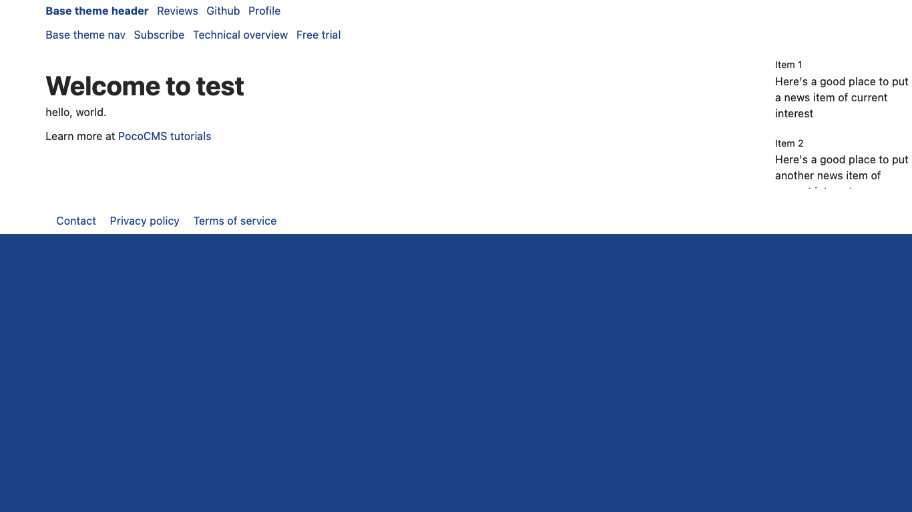
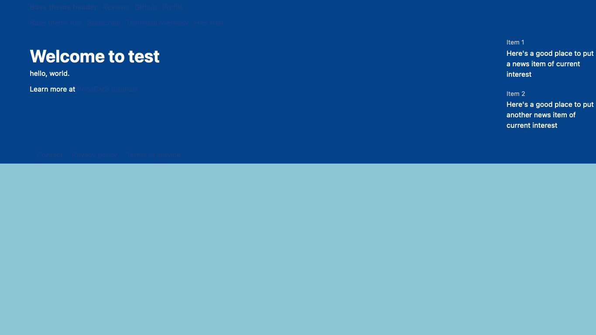
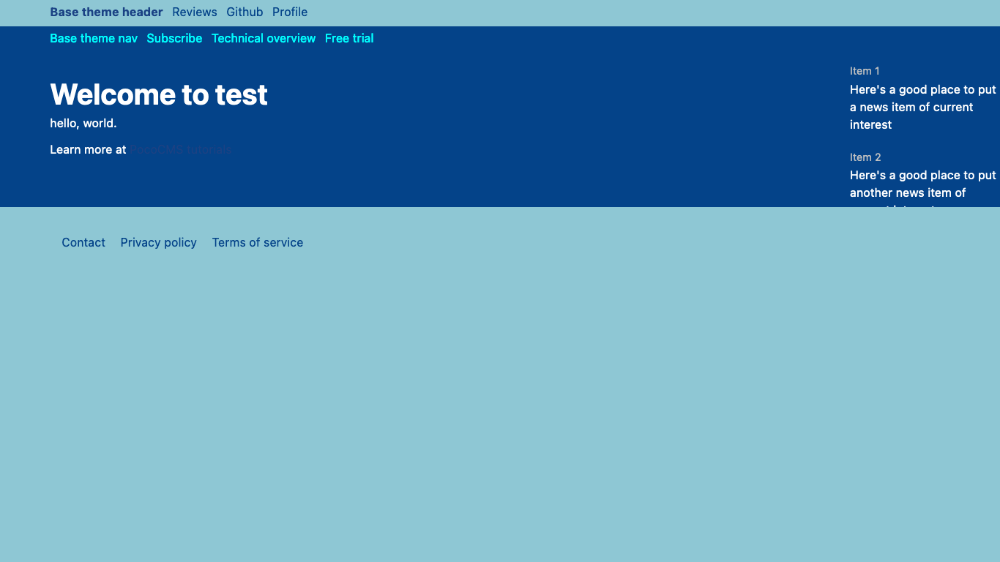
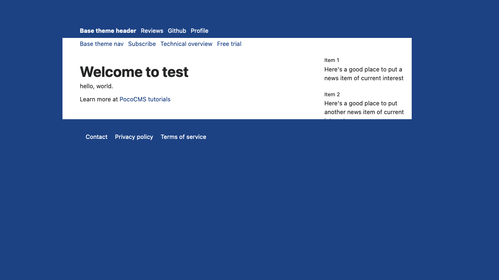
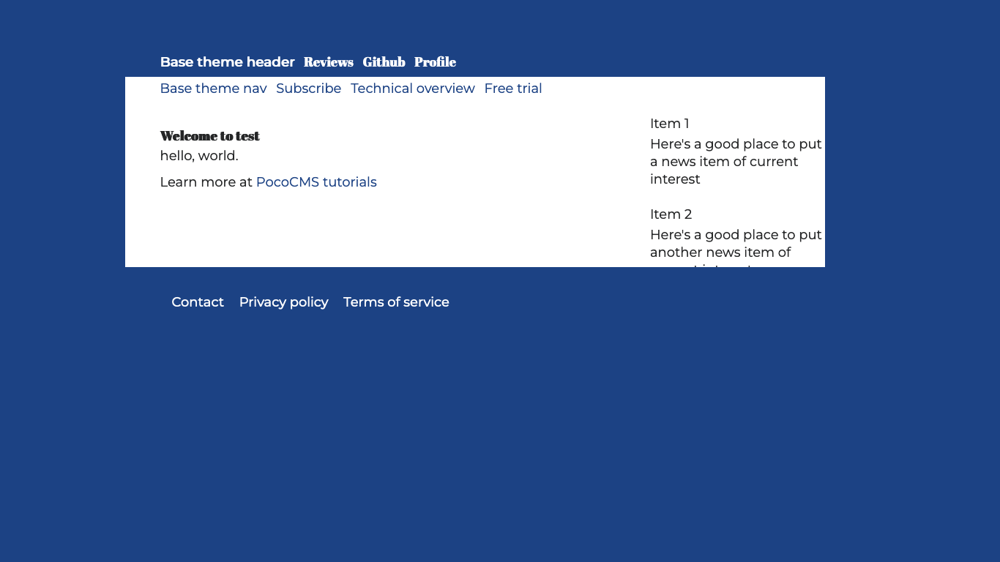
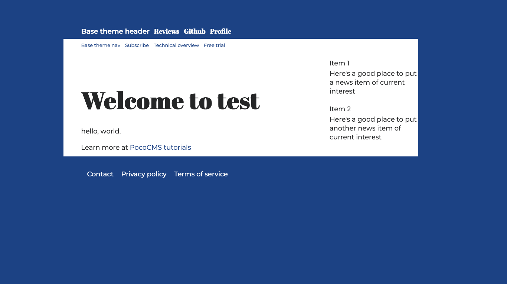

# TODO:
* Downloading fonts
* style tags
* skinny
* Dark themes
* Ideally a nested theme
* Goal is to change things in only 1 place
* BREAK THESE SECTIONS UP WHEN THEIR ORDER IS CLEAR 

# Creating a PocoCMS theme with the framework

The best way to create a highly versatile theme
is to use the PocoCMS [theme framework](theme-framework.html).
It's contained entirely in the Base theme and is the
launchpad for all PocoCMS framework themes, from [Electro](demos/electro.html) to
[Clerk](demos/clerk.html) to [Skyscraper](demos/skyscraper.html).

Here's the theme we'll create:



## Overall strategy

The way to create a theme using the theme framework is simple:
add a stylesheet and put all the changes in there. This
guide takes you through every step of the way
to create a theme using that technique.

## Start a new project

Each Poco project is self-contained, with all theme data
contained within the `.poco/themes` subdirectory.
It's easy to copy a theme elsewhere when you're finished
but right now the safest thing to do is to start
with a test project. We'll call it `mytheme`.

```
poco -new test
cd test 
```

## Copy a theme you like

The first thing is to copy a theme you like.

* To copy a theme, choose the theme you want to start with. 
[Base](https://pococms.com/docs/demos/base.html) is the
best place to start. It is a pretty neutral theme meant
to be customized.

* Copy the `base` theme like this:

```
poco -from base -to mytheme 
```
You're then informed:

```
PocoCMS mytheme created
```

##  Append themename.css to end of the theme's stylesheets rule

* Load the theme's `README.md` file from your project's [root directory](#glossary.html#root-directory) by editing the file `.poco/themes/mytheme/README.md`. Obviously
you will replace `mytheme` with whatever theme name you created.
* It will look something like this, in the example where your
theme was copied from the Base theme:

```
---
stylesheets:
- ../../css/root.css
- ../../css/reset.css
- ../../css/sizes.css
- ../../css/layout.css
- ../../css/type.css
- ../../css/mediacolors.css
---
```
* Immediately append the `.css` named after your theme 
to the *end* of the `stylesheets` list:

```
stylesheets:
- ../../css/root.css
- ../../css/reset.css
- ../../css/sizes.css
- ../../css/layout.css
- ../../css/type.css
- ../../css/mediacolors.css
# ADD THE LINE BELOW. Replace gossip with your theme name:
- mytheme.css

```

The contents of `mytheme.css` are pretty much blank and
will have no affect on the theme so far:


```
/* OVERRIDE FRAMEWORK SIZES */

/* OVERRIDE FRAMEWORK LAYOUT */

/* OVERRIDE FRAMEWORK TYPOGRAPHY AND FONTS */

/* OVERRIDE MEDIA QUERIES. COLORS FOR LIGHT & DARK THEMES */
@media (prefers-color-scheme:light) {
:root {
}
}

@media (prefers-color-scheme:dark) {
:root {
}
}
```

* Let's test it. 

## Add the theme to your index.md file

* You should be in the directory you just created named `test`. Open the file `index.md`
and add this line to the front matter so you can see the new theme:
```
---
theme: mytheme 
---
```

## Run poco -serve

* Open a new terminal window.
* Change to your test directory
* Run the server:

```
poco -serve
18 Jan 12:34:56 Web server running at:

http://localhost:54321

To stop the web server, press Ctrl+C
```
* Paste the URL `http://localhost:54321` into a browser.

You should see the test site:



Right now we're just at parity with the Base theme. Next
we'll learn about turning Base into something better
for a blog.

The following steps are sort of random; you could do them in any order
and still come out with the same results.


## Create light and dark themes

The theme framework has built-in support for both light and dark themes.
It comes with many sensible defaults but none of them is sacred.
Load `.poco/themes/mytheme/mytheme.css` and let's start like this.
Feel free to copy and paste the code shown below.

```
@media (prefers-color-scheme:light) {
:root {
  --a:var(--html-bg);         /* Default link color */
  --fg:#252627;               /* Default text color */ 
  --bg:white;                 /* Default background color */ 
  --html-bg:#1C4284;          /* Color enclosing skinny themes */
}
}
```

If you're not too familiar with CSS we'll explain what's happening
in a moment.


### Take a look

We'll assume you do the following every time you make a 
change to the theme style sheet. We aren't going to repeat
this instruction because it would get super annoying
to read. So whenever we say something like "take a look" or anytime
you feel it necessary, and more is better when you're using CSS
because minor errors can cause scary-looking problems,
we mean:

* Switch to the terminal window that has your `test` directory current.
* Run poco to rebuild the site (the exact directory shown will be different)

```
poco
Site published to test/WWW/index.html
```
* Switch to the browser you have running the URL `http://localhost:54321` 
* Refresh the page.



### Override CSS styles

Recall that CSS is *cascading*, which means that you can simply add a rule
to replace an old one. You don't have to get rid of the old one. Whichever
rule is encountered most recently is the one that takes priority.

Let's see what's happening in this rule:

```
--bg:white;                 /* Default background color */ 
```

The `--bg` rule says "take the previously defined CSS variable named `--bg` and
replace it with the color white". Where is the original `--bg` rule? It comes
from the stylesheet named [.poco/css/root.css](https://github.com/pococms/poco/blob/main/.poco/css/root.css), which has a number of such
rules. It defines default values that look fine on their own, but which
you're expected to replace as necessary in your theme. As you can see 
in `root.css` and the comment above, it's the default background color for text.

When you see usage such as `background-color:var(--bg);` you'll know
to replace `var(--bg)` with the most recent value of `--bg`, which is
white in this example. 

Why not just say `background-color:white;` and be done with it? Because

1. It's better to limit the number of places that value occurs when you decide to make a change.
2. Replacing direct color names with symbolic values makes it easier to create dark and light themes at the same time.
3. It can be propagated elsewhere, which relates to the first point. Take a look at
this rule, also from `root.css`:

```
--header-bg:var(--bg);      /* Background color of header */
```

This rule says "use the same background for [headers](glossary.html#header) as the article uses". You can change
it anytime, but frequently you'll prefer them to use the same background color.

You'll see it again for the [nav](glossary.html#nav):

```
--nav-bg:var(--bg);         /* Background color of nav */
```

Now you can see a pattern:

```
--a:var(--html-bg);         /* Default link color */
--html-bg:#1C4284;          /* Color enclosing skinny themes */
```

This tells us that the background behind the theme background will be a bluish
color (`#1C4284`), and that links will use that color too.

### Override CSS color rules with root

Put all rules that override CSS variables in the `:root` followed by `{` and `}`. They'll be hoisted to
the top of the priority list.

```
:root {
  --a:var(--html-bg);         /* Default link color */
  --html-bg:#1C4284;          /* Color enclosing skinny themes */
  ..etc
}

```

## Create the dark theme

Some users prefer light themes, but others like themes that work better at night.
Browsers and operating systems now have built-in support for dark themes.

* Update the  `@media (prefers-color-scheme:dark)` portio of `mytheme.css` with these dark theme values:

```
@media (prefers-color-scheme:dark) {
  a,footer > a {color:#1B4284;}
  header{color:#1B4284;}
  header > ul > li:first-child > a > del {color:#E63946;} /* Strikethrough text gets different color */
:root {
  --fg:white;                 /* Default text color */ 
  --bg:#044389;               /* Default background color */
  --html-bg:#8EC7D4;          /* Color enclosing skinny themes */
}
}
```

* Set your system to dark mode and take a look:

 

The beginnings of a dark theme... but suddenly the header and footer look like they're missing.
They aren't. Their colors have been overridden and there are background/foreground color clashes.


### Restyle links

Add this just after the comment reading `OVERRIDE MEDIA QUERIES. COLORS FOR LIGHT & DARK THEMES`
and just before the `@media (prefers-color-scheme:light)` code:

```
header,footer {background-color:var(--html-bg);}
header>ul>li>a,header>ul>li>a:hover,header>ul>li>a:active {color:var(--bg)}
header,footer {background-color: var(--html-bg);}
nav ul li a  {color:var(--a);} 
nav a:active,nav a:hover {color:var(--html-bg);}
aside>p> a {color:var(--fg);}
footer>ul>li>a,footer>ul>li>a:hover,footer>ul>li>a:active {color:var(--bg);}
```

* Take a look now:

 

A brief look at what you just did:

**Alter header and footer background colors** Here the header and footer background colors are changed to be the same
as the HTML background, which only matters on [skinny themes](glossary.html#skinny-theme):

```
header,footer {background-color:var(--html-bg);}
```

This isn't a skinny theme yet but it will be soon.

**Change link colors** A quick review. In most themes, everything in the header and footer is a link.
The markup of a header file might look like this:

```
* [Base theme header](#)
* [Reviews](#)
* [Github](#)
* [Profile](#)
```

As you can see, it's a list of links, technically, an HTML [unordered list](https://developer.mozilla.org/en-US/docs/Web/HTML/Element/ul) of links. Normally an unordered list shows a bullet for each item and each item
has its own line in what is known as a block display. (Headings and paragraphs are normally blocks too,
at least in the `<article>` portion of a page.) The vast majority of sites re-style the
unordered list in the nav, header, and footer to appear in a horizontal line without the bullet characters.

Let's break down the CSS.

To restyle the header alone, PocoCMS uses very specific CSS so that only it gets that style. The theme
framework is meant for you to style header, nav, footer, aside, and article separately. In the line below,
you're targeting the `header`, then unordered lists in the header (`<ul>/</ul>`), and individual items
in that list (`<li>/</li>`), and finally links (`<a href...</a>`). And finally, we are setting the
background color of the link to the text background color with `var(--bg)`:

```
header ul li a {color:var(--bg)}
```

The rest continues to restyle header links for when the cursor is held over
the link (`hover`) or when it's clicked (`active`):


```
header ul li a,header ul li a:hover,header ul li a:active {color:var(--bg)}
```

Roughly similar treatments are given to the footer and aside.

## Make it a skinny theme

A [skinny theme](glossary.html#skinny-theme) is one that floats in a separate 
background color or outline. The theme framework makes it simple to add
that quality to your theme. 

* Insert `../../css/medium-skinny.css` this just after `../../css/layout.css` in the 
`stylesheets` portion of your theme README.md file. 
It's at `.poco/themes/mytheme/README.md` (replace
`mytheme` with whatever theme directory name you chose):

```
stylesheets:
- ../../css/root.css
- ../../css/reset.css
- ../../css/sizes.css
- ../../css/layout.css
# Add either this or ../../css/skinny.css just after layout.css:
- "../../css/medium-skinny.css"
- ../../css/type.css
- ../../css/mediacolors.css
- "mytheme.css"
```




If you use `skinny.css` instead of `medium-skinny.css` the article area will be
even more narrow. These files change the margins, which you can think of as 
pushing inward from the outside of the page. Now you see what the `--html-bg` CSS
variable is used for.

Be careful if you tweak these skinny stylesheets. It can get... tricky.

## Add downloadable font for headings

The distinctive font you saw in the illustration of the finished theme is charmingly called
[Abril Fatface](https://fonts.google.com/specimen/Abril+Fatface). The body text is called
[Montserrat](https://fonts.google.com/specimen/Montserrat).

They're both from Google and
are freely usable for commercial purposes. Here's the easiest way to
use a downloadable font that's make publicly available on a CDN like Google's.

Insert this line under `stylesheets` just before `../../css/type.css`:

```
- "https://fonts.googleapis.com/css2?family=Abril+Fatface&family=Montserrat:ital@0;1&display=swap" 
```

The whole `stylesheets` section now looks like this:

##### File: **.poco/themes/mytheme/README.md**

```
stylesheets:
- ../../css/root.css
- ../../css/reset.css
- ../../css/sizes.css
- ../../css/layout.css
- "../../css/medium-skinny.css"
- "https://fonts.googleapis.com/css2?family=Abril+Fatface&family=Montserrat:ital@0;1&display=swap" 
- ../../css/type.css
- ../../css/mediacolors.css
- "mytheme.css"
```

* In `.poco/themes/mytheme/mytheme.css` add the following under 
the `OVERRIDE FRAMEWORK TYPOGRAPHY AND FONTS` comment:

```
/* OVERRIDE FRAMEWORK TYPOGRAPHY AND FONTS */
html * {font-family: 'Montserrat', sans-serif;font-size:large;line-height:1.5rem;}
article>h1,article>h2,article>h3{font-family: 'Abril Fatface', serif;}
header>ul>li> a,header>ul> li:first-child > a > del {
  font-family: 'Abril Fatface', serif;
  text-decoration:none;
}
```

* Look at your progress so far:




This line shows how to change most font attributes at once:

```
html * {font-family: 'Montserrat', sans-serif;font-size:large;line-height:1.5rem;}
```

This line uses the display font Abril Fatface on major headings in the [article](glossary.html#article)
portion of your page, which means it won't change some parts like the header:

```
article>h1,article>h2,article>h3{font-family: 'Abril Fatface', serif;}
```

This changes unordered list elements in the header to use Abril Fatface, 
not to change appearance when treated as a link, and to make those
same changes to any strikethrough usage in the list item in the header 
(more on that later, 
but it's the `header>ul> li:first-child > a > del` part).

```
header>ul>li> a,header>ul> li:first-child > a > del {
  font-family: 'Abril Fatface', serif;
  text-decoration:none;
}
```

## Adjust font sizes

The Base theme is so boring it leaves all headings the same size. 
Let's fix that, because larger headings normally have more 
semantic importance. It's a helpful cue to the reader.

Just under the  `OVERRIDE FRAMEWORK SIZES` comment add this:


```
nav ul li a  {font-size:small;} 
article{padding-top:4rem;padding-right:3rem;}
article>h1,article>h2,article>h3{line-height:1em;}
article>h1 {font-size:4rem;padding-bottom:2rem;}
article>h2 {font-size:3rem;padding-bottom:1.5rem;}
article>h3 {font-size:1.75rem;padding-bottom:1rem;}
article>h4 {font-size:1.25rem;}
article>p, article>ul>li,article>ol>li {line-height:2rem;}
article>ul, article>ol {padding-bottom:1.5rem;}
```

The result is starting to hold more visual interest:




### Change heading font size and padding

You can imagine that these additions make headings in the article bigger
and better spaced:

```
article{padding-top:4rem;padding-right:3rem;}
article>h1,article>h2,article>h3{line-height:1em;}
article>h1 {font-size:4rem;padding-bottom:2rem;}
article>h2 {font-size:3rem;padding-bottom:1.5rem;}
article>h3 {font-size:1.75rem;padding-bottom:1rem;}
article>h4 {font-size:1.25rem;}
```

### Reduce nav height and font size

This makes the nav shorter and with a smaller font, simply for stylistic reasons.
Using `font-size:small` instead of a fixed size makes it easier to scale the
web page for visually impaired users.

```
nav ul li a  {font-size:small;} 
```

### Remember to change article list font size along with paragraph

You will surmise that this changes the line height of the article text:

```
article>p {line-height:2rem;}
```

It's easy to forget that both ordered and unordered lists will look weird
if you don't make the same change. Also it's good to give the bottom
of a list some breathing room, so in sum:

```
article>p, article>ul>li,article>ol>li {line-height:2rem;}
article>ul, article>ol {padding-bottom:1.5rem;}
```

## Make header and footer flush left

This theme left-justifies the header and footer.
Add thise code under the `OVERRIDE FRAMEWORK LAYOUT` comment.

```
/* OVERRIDE FRAMEWORK LAYOUT */
header,footer {padding-left:0;}
footer > ul > li {margin-left:0; margin-right: 1em;}
```

The change is small but noticeable:


## Make aside default to left side

You may remember that using the
Under
the code you just added in the `OVERRIDE FRAMEWORK LAYOUT` comment
section append these lines:


```
/* Default to article on the right, aside on the left */
article{float:right;clear:right;}    
aside{float:left;}  
```


###### [Previous: Add a classless stylesheet to your theme](th-add-classless-css.html)


