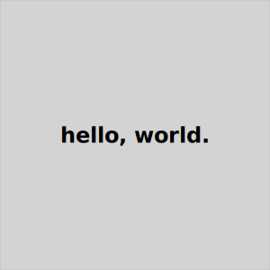

# Utilities

These utilities are unsupported and of limited use.

* [poco-dir-upate](#poco-dir-update) copies the master `.poco`
directory into the current project.
* [poco-gen-theme-test](#poco-gen-theme-test) generates a number of pages
to demonstrate theme features such as headers, asides, footers, and so on.
* [svgplace](#svgplace) generates placeholder image files

## poco-dir-update

A Bash/zsh script to copy the contents of the application's `.poco` directory 
to the current project. It's useful in the following circumstances:
* You've made changes to themes in the 

## poco-gen-theme-test

A Bash/zsh script to show theme options. It generates Markdown
files to exercise many options available in a theme, generates
a page for each option, then creates a site in a temporary directory
so you can see them for yourself. (The operating system eventually
deletes the temporary directory so you don't need to dispose of it.)

Some of the options it creates:

- Article only with no header, nav, aside, or footer
- Header suppressed
- Nav suppressed
- Footer suppressed 
- Aside suppressed 
- Aside on left
- Aside on right
- Version with background shaded on all page layout elements
- And more.

Just run it from the command line followed by the name of a theme,
like this, where you'd replace `pocodocs` with whatever theme
you wish to try:

```
poco-gen-theme-test pocodocs
```

By the way, you can see what themes are installed in your project like this:

```
poco -themes
```

## svgplace

The `svgplace` Bash/zsh script generates a placeholder SVG file in the shape of a box, with optional text inside. 

The command line options are, in order:

* Width
* Height
* Text in quotes
* Filename

They are all optional with default values.

Example invocations:

```
# Create a 256x128 empty box with the filename foo.svg
svgplace
```

Result:


```
# Create a 200x200 empty box with the filename foo.svg
svgplace 200 200
````
 
Result:


```
# Create a 300x300 box with the text "hello, world."
svgplace 300 300 "hello, world." box.svg
```



