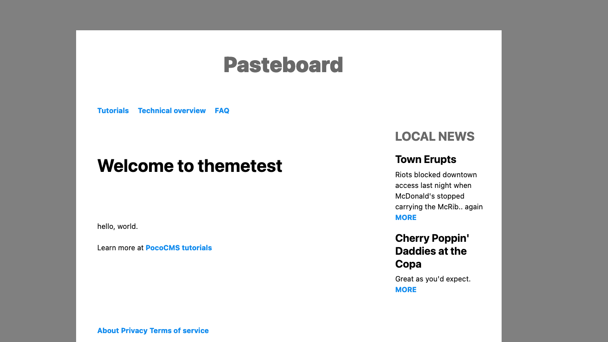
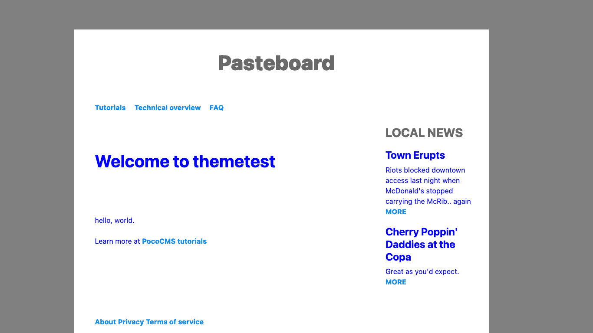
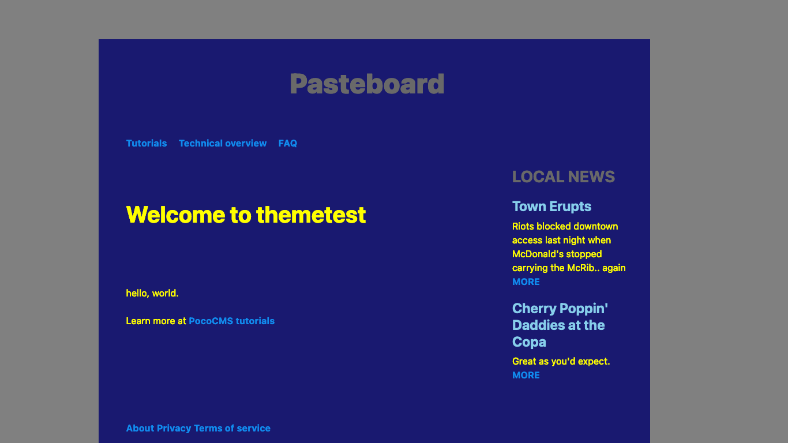

# PocoCMS workflow

Here's an idea of how you'll typically create a PocoCMS project
and keep it going. 

## How to start and maintain a PocoCMS project

The process is pretty simple:

1. Create a new project
2. Copy the theme you like best
3. Make changes to the theme copy instead of the original


This section takes you through those steps
to give you a feel for the cycle.

### Create a new project

Drop into your terminal/command line and use `poco -new`:

1. For ease and clarity, the tutorials imply you'll be working 
of you current directory, like so:

```
poco -new mysite
cd mysite
````

2. But you can specify a site anywhere:
```
poco -new ~/code/html/mysite
cd ~/code/html/mysite
````

### List themes

To see what themes are available, enter this at the command line:

```
poco -themes
```

You'll get a list something like this:

```
base
clerk
electro
informer
mytheme
newman
paper
pasteboard
pocodocs
rawdog
skyscraper
tufte
```

* And of course you can see the factory-installed themes live at
[PocoCMS theme demos](https://pococms.com/docs/theme-demos.html)

### Copy a theme you like

It's best to copy a theme you like instead working with it directly,
because you'll want to make numerous small changes.
That way if you  make any big mistakes and want to revert, you'll have 
the factory original to fall back on.

* To copy a theme, choose the theme you want to start with. Let's
say it's [Pasteboard](https://pococms.com/docs/demos/pasteboard.html).
* Decide on name of your new theme, which of course in this example will
be `mytheme` because hey, it's all about you.
* Copy the theme like this:

```
poco -from pasteboard -to mytheme
```
You're then informed:

```
PocoCMS mytheme created
```

Now to use your theme, just specify it in the
front matter as you would any other:

```
---
theme: mytheme
---
```

###  Add themename.css to the theme's README.md file

* Load the theme's `README.md` file from your project's [root directory](#glossary.html#root-directory) by editing the file `.poco/themes/mytheme/README.md`. Obviously
you will replace `mysite` with whatever theme name you created.
* It will look something like this, in the example where your
theme was copied from the Pasteboard theme:

```
---
header: header.md
nav: nav.md
aside: aside.md
footer: footer.md
stylesheets:
- ../../css/root.css
- ../../css/reset.css
- ../../css/colors.css
- "https://unpkg.com/mvp.css@1.12/mvp.css"
- ../../css/sizes.css
- ../../css/layout.css
- "../../css/medium-skinny.css"
- "pasteboard.css"
- ../../css/media.css
---
```
* Immediately append the `.css` named after your theme to the *end* of the `stylesheets`
list:

```
stylesheets:
- ../../css/root.css
- ../../css/reset.css
- ../../css/colors.css
- "https://unpkg.com/mvp.css@1.12/mvp.css"
- ../../css/sizes.css
- ../../css/layout.css
- "../../css/medium-skinny.css"
- "pasteboard.css"
- ../../css/media.css
- "mytheme.css"
```

The contents of `mytheme.css` are pretty much blank and
will have no affect on the theme so far:


```
/* OVERRIDE FRAMEWORK SIZES */

/* OVERRIDE FRAMEWORK LAYOUT */

/* OVERRIDE FRAMEWORK TYPOGRAPHY AND FONTS */

/* OVERRIDE MEDIA QUERIES. COLORS FOR LIGHT & DARK THEMES */
@media (prefers-color-scheme:light) {
:root {
  --fg:blue;
}
}

@media (prefers-color-scheme:dark) {
:root {
  --fg:lightgray;
}
}
```

* Create a page using that theme and view it in your browser:

```
---
title: "Powered with &hearts; by PocoCMS"
theme: mytheme
---
# Welcome to themetest

hello, world.

Learn more at [PocoCMS tutorials](https://pococms.com/docs/tutorials.html) 
```

Resulting in:




### Make most theme changes in themename.css

When you add to your theme, changes in `mytheme.css`
(replacing `mytheme` with the name of the theme
you just created). It's even set up for maximum
organization. 

* Let's change the default foreground (text) color
used for both light and dark themes.

```
/* OVERRIDE MEDIA QUERIES. COLORS FOR LIGHT & DARK THEMES */
@media (prefers-color-scheme:light) {
:root {
  --fg:blue;
}
}

@media (prefers-color-scheme:dark) {
:root {
  --fg:yellow;
}
}
```

* Rebuild the site and take a look:



If you're in dark mode you'll see:




